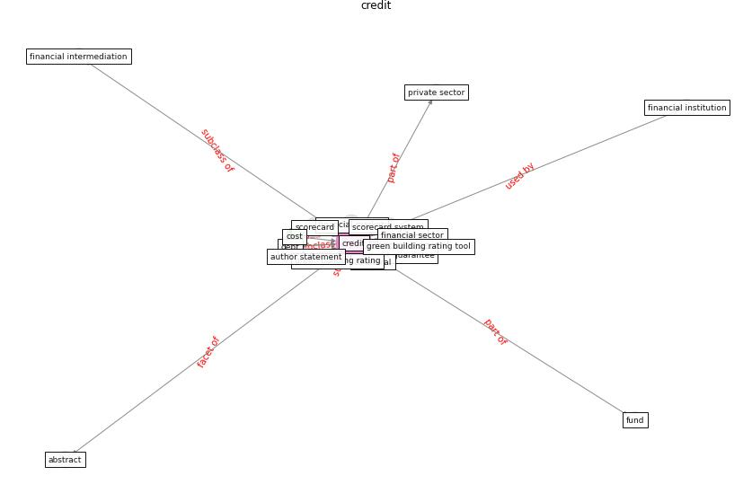

# Keyword: __credit__
## Clusters

* Cluster 9: [resilience-infrastructure](cluster_9)

## Concepts

 

## Articles
* Readiness Assessment of Green Building
Certification Systems for Residential Buildings
during Pandemics ([tleuken_readiness_2021](article_tleuken_readiness_2021))
* world_bank_world_2022-200 ([world_bank_world_2022-200](article_world_bank_world_2022-200))
* world_bank_world_2022-50 ([world_bank_world_2022-50](article_world_bank_world_2022-50))
* world_bank_world_2022-150 ([world_bank_world_2022-150](article_world_bank_world_2022-150))
* Designing a Multi-Agent Occupant Simulation
System to Support Facility Planning and Analysis
for COVID-19 ([lee_designing_2021](article_lee_designing_2021))
* COVID-19 and regional solutions for mitigating the risk
of SME finance in selected ASEAN member states ([taghizadeh-hesary_covid-19_2022](article_taghizadeh-hesary_covid-19_2022))
* p15-lee-vor-0 ([p15-lee-vor-0](article_p15-lee-vor-0))
* world_green_building_council_health_2014-200 ([world_green_building_council_health_2014-200](article_world_green_building_council_health_2014-200))
* world_bank_world_2022-350 ([world_bank_world_2022-350](article_world_bank_world_2022-350))
* Sustainability of Coronavirus on Different
Surfaces ([suman_sustainability_2020](article_suman_sustainability_2020))
