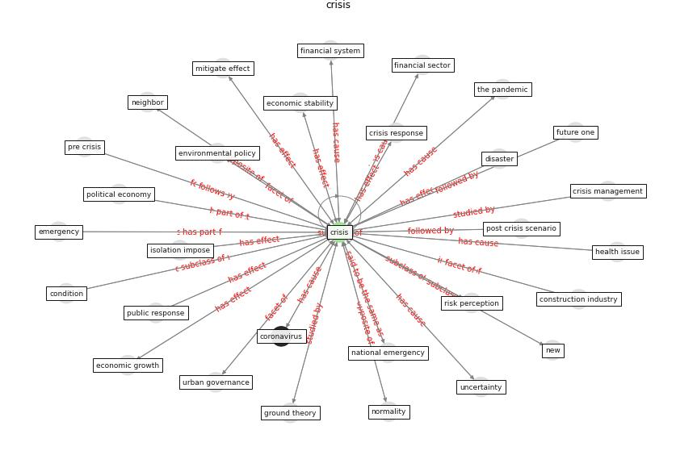

# Keyword: crisis

* [economic-health](cluster_Cluster_5)

* [construction-resilience](cluster_Cluster_9)

## Keywords

 * adaptive strategy, [bank](keyword_bank), bricolage, business as usual, business process, calm, cascade, cascade one, cash transfer, cashflow, cgap, clean energy, [climate change](keyword_climate_change), climate policy, climate policy after the crisis, communication, [construction industry](keyword_construction_industry), construction technology, [coronavirus](keyword_coronavirus), corporate, [covid 19 crisis](keyword_covid_19_crisis), [covid 19 pandemic](keyword_covid_19_pandemic), covid 19 recession, [covid-19](keyword_covid-19), [crisis](keyword_crisis), crisis management, crisis response, current, dirt on our hand, disaster, disruption, [economic crisis](keyword_economic_crisis), economic growth, economic risk, economic stability, [economy](keyword_economy), emergency, [entrepreneurship](keyword_entrepreneurship), firm credit in the euro area, frontline worker, future one, good way out, government lending, greece, greek, [green space](keyword_green_space), ground theory, health emergency, health issue, [healthcare system](keyword_healthcare_system), high unemployment, humanitarian crisis, [impact](keyword_impact), isolation impose, long run, [malaysia](keyword_malaysia), medium, mitigate effect, morph, [need](keyword_need), nonperforme loan, normality, opportunity, [outbreak](keyword_outbreak), output growth, pakistani mfis and regulator, [pandemic](keyword_pandemic), pandemic crisis, pandemic in india, pandemic situation, period of crisis, [plan](keyword_plan), policy response, post covid 19, post covid world, post crisis scenario, pre crisis, pre preparation, [public health](keyword_public_health), public health crisis, public response, rapid response, recession, [resilience](keyword_resilience), response to the covid 19 crisis, [risk perception](keyword_risk_perception), run away from crisis, scarcity of resource, scientific advice, [shock](keyword_shock), short term, solidarity, strategic response, structuralchange, the crisis, the pandemic, uncertainty, [urban governance](keyword_urban_governance), well prepare for crisis, what crisis

## Concepts

 

## Neighbours

### Closest articles

* How COVID-19 Could Accelerate the Adoption of New Retail Technologies and Enhance the (E-)Servicescape - [LINK](article_willems_how_2021)
* World Bank Development Report - [LINK](article_world_bank_world_2022)
* Startups in times of crisis – A rapid response to the COVID-19 pandemic - [LINK](article_kuckertz_startups_2020)
* Preparing critical infrastructure for the future: Lessons learnt from the Covid-19 pandemic - [LINK](article_tomalska_preparing_2022)
* Amplifying the role of knowledge translation platforms in the COVID-19 pandemic response - [LINK](article_el-jardali_amplifying_2020)
* Seeing the invisible hand: Underlying effects of COVID-19 on tourists’ behavioral patterns - [LINK](article_li_seeing_2020)
* What our response to the COVID-19 pandemic tells us of our capacity to respond to climate change - [LINK](article_gemenne_what_2020)
* DfMA for rapid adaptive resilience and flexible infrastructure - [LINK](article_mott_macdonald_dfma_2020)
* <scp>COVID</scp>             ‐19: Small and medium enterprises challenges and responses with creativity, innovation, and entrepreneurship - [LINK](article_thukral_covid19_2021)
* The Effects of Pandemic on Construction Industry in the UK - [LINK](article_shibani_effects_2020)

### Closest BPs

