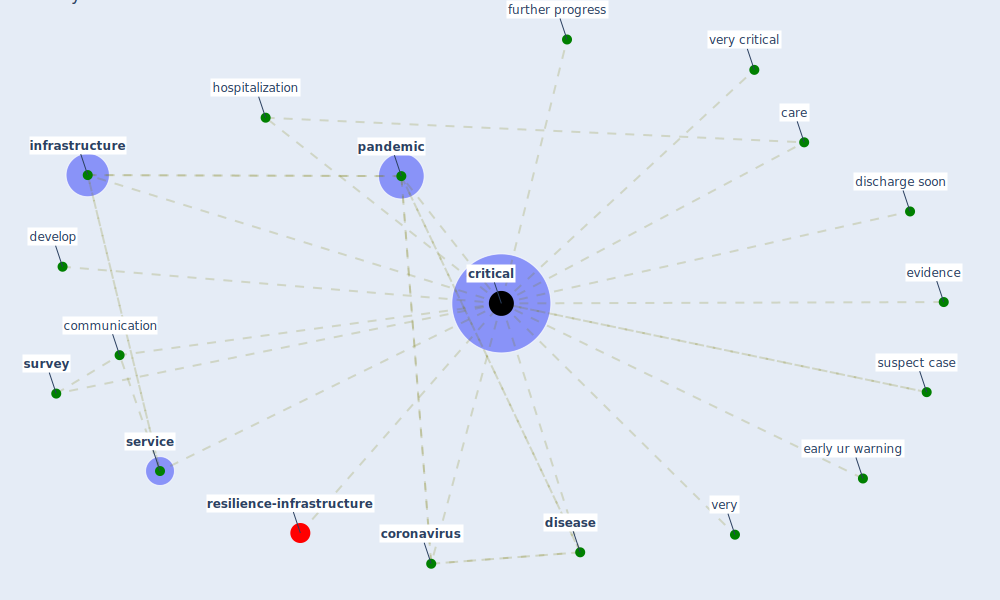

# Keyword: critical

* [resilience-infrastructure](cluster_11)

## Keywords

 * Cluster_11, care, communication, [coronavirus](keyword_coronavirus), [critical](keyword_critical), develop, discharge soon, [disease](keyword_disease), early ur warning, [evidence](keyword_evidence), further progress, hospitalization, [infrastructure](keyword_infrastructure), [pandemic](keyword_pandemic), [service](keyword_service), [survey](keyword_survey), suspect case, very, very critical

## Mapping

## Neighbours

### Closest articles

*  - [LINK](article_mehtab_alam_role_2021)
* World Bank Development Report - [LINK](article_world_bank_world_2022)
* A Review on Building Design as a Biomedical System for Preventing COVID-19 Pandemic - [LINK](article_amran_review_2022)
* Wastewater surveillance for population-wide Covid-19: The present and future - [LINK](article_daughton_wastewater_2020)
* Rapid expansion of temporary, reliable airborne-infection isolation rooms with negative air machines for critical COVID-19 patients - [LINK](article_lee_rapid_2020)
* Impact of COVID-19 on IoT Adoption in Healthcare, Smart Homes, Smart Buildings, Smart Cities, Transportation and Industrial IoT - [LINK](article_umair_impact_2021)
* COVID19-Routes: A Safe Pedestrian Navigation Service - [LINK](article_cantarero_covid19-routes_2021)
* COVID-19 as a Harbinger of Transforming Infrastructure Resilience - [LINK](article_carvalhaes_covid-19_2020)
* A Comprehensive Review of the COVID-19 Pandemic and the Role of IoT, Drones, AI, Blockchain, and 5G in Managing its Impact - [LINK](article_chamola_comprehensive_2020)

### Closest BPs

