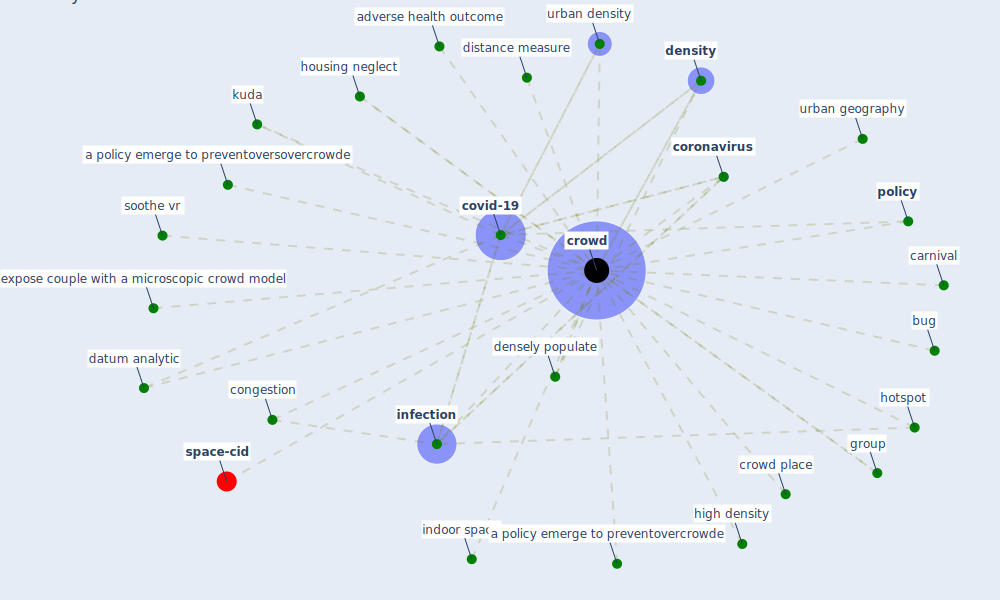

# Keyword: crowd

* [space-cid](cluster_2)

## Keywords

 * Cluster_2, a policy emerge to preventovercrowde, a policy emerge to preventoversovercrowde, adverse health outcome, bug, carnival, congestion, [coronavirus](keyword_coronavirus), [covid-19](keyword_covid-19), [crowd](keyword_crowd), crowd place, crowded, crowding, crowds, datum analytic, densely populate, [density](keyword_density), distance measure, expose couple with a microscopic crowd model, group, high density, hotspot, housing neglect, indoor space, [infection](keyword_infection), kuda, [policy](keyword_policy), soothe vr, urban density, urban geography

## Mapping

## Neighbours

### Closest articles

* Urban design attributes and resilience: COVID-19 evidence from New York City - [LINK](article_yang_urban_2021)
* COVID19-Routes: A Safe Pedestrian Navigation Service - [LINK](article_cantarero_covid19-routes_2021)
* Designing a Multi-Agent Occupant Simulation System to Support Facility Planning and Analysis for COVID-19 - [LINK](article_lee_designing_2021)
* Understanding the role of urban design in disease spreading - [LINK](article_brizuela_understanding_2019)
* Houses amid COVID-19: Environmental challenges and design adaptation - [LINK](article_hizra_houses_2021)
* Antivirus-built environment: Lessons learned from Covid-19 pandemic - [LINK](article_megahed_antivirus-built_2020)
* The COVID-19 pandemic: Lessons on building more equal and sustainable societies - [LINK](article_van_barneveld_covid-19_2020)
* A Review on Building Design as a Biomedical System for Preventing COVID-19 Pandemic - [LINK](article_amran_review_2022)
* Heating, ventilation and air-conditioning systems in the context of COVID-19 - [LINK](article_ecdc_heating_2020)
* How COVID-19 Could Accelerate the Adoption of New Retail Technologies and Enhance the (E-)Servicescape - [LINK](article_willems_how_2021)

### Closest BPs

