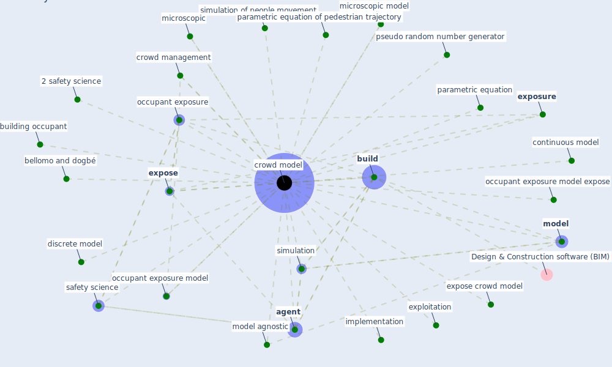

# Keyword: crowd model

## Keywords

 * 2 safety science, [agent](keyword_agent), bellomo and dogbé, [build](keyword_build), building occupant, continuous model, crowd management, [crowd model](keyword_crowd_model), crowd modeling, crowd modelling, crowd models, discrete model, exploitation, [expose](keyword_expose), expose crowd model, [exposure](keyword_exposure), implementation, microscopic, microscopic model, [model](keyword_model), model agnostic, [occupant exposure](keyword_occupant_exposure), occupant exposure model, occupant exposure model expose, parametric equation, parametric equation of pedestrian trajectory, pseudo random number generator, safety science, [simulation](keyword_simulation), simulation of people movement, verification and validation

## Mapping

## Neighbours

### Closest articles

* EXPOSED: An occupant exposure model for confined spaces to retrofit crowd models during a pandemic - [LINK](article_ronchi_exposed_2020)
* A review of facilities management interventions to mitigate respiratory infections in existing buildings - [LINK](article_zhang_review_2022)
* The effect of occupant distribution on energy consumption and COVID-19 infection in buildings: A case study of university building - [LINK](article_mokhtari_effect_2021)

### Closest BPs

