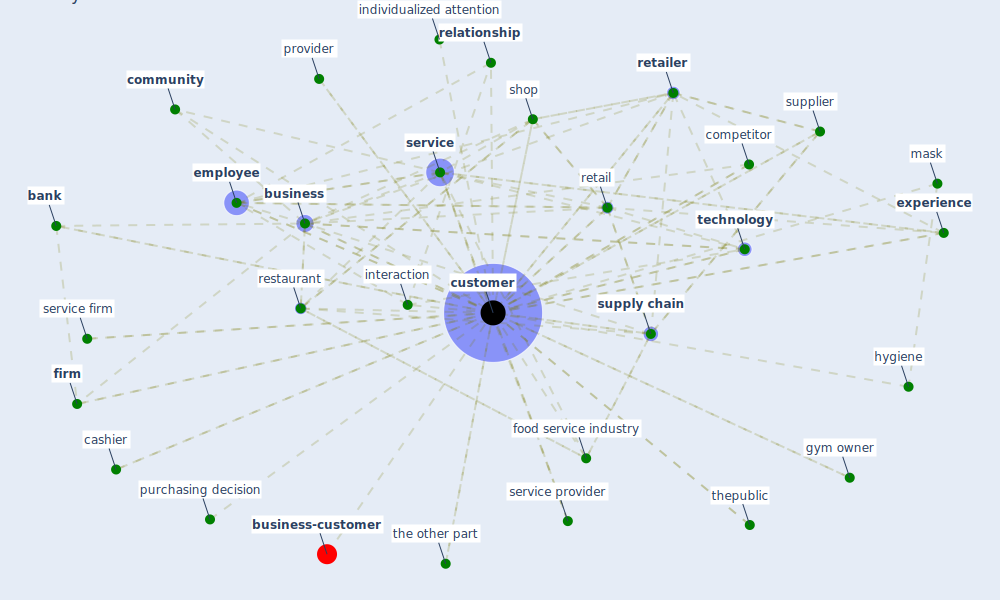

# Keyword: customer

* [business-customer](cluster_11)

## Keywords

 * Cluster_11, [bank](keyword_bank), barrier, brick and mortar store, [business](keyword_business), cashier, coffee shop, [community](keyword_community), competitor, [consumer](keyword_consumer), consumption, consumption experience, content, coworke, [customer](keyword_customer), customer acquisition, customer experience, customer face employee, [customer journey](keyword_customer_journey), customer need, customer satisfaction, customer support, customers, decision make, digitalization, direct interaction, e commerce, [employee](keyword_employee), [experience](keyword_experience), face to face banking, [firm](keyword_firm), food service industry, gym owner, hygiene, individualized attention, individualized attention to their customer, insight, [interaction](keyword_interaction), invoice, [mask](keyword_mask), [need](keyword_need), perception, point of purchase, product, product and or service, provider, purchasing decision, [relationship](keyword_relationship), [remote](keyword_remote), restaurant, retail, [retailer](keyword_retailer), satisfaction, seat arrangement, segment, seller, [service](keyword_service), service firm, service provider, [shop](keyword_shop), small business, [sme](keyword_sme), [stakeholder](keyword_stakeholder), stop and look, supermarket, supplier, [supply chain](keyword_supply_chain), [technology](keyword_technology), the other part, thepublic, trust, utility

## Mapping

## Neighbours

### Closest articles

* How COVID-19 Could Accelerate the Adoption of New Retail Technologies and Enhance the (E-)Servicescape - [LINK](article_willems_how_2021)
* Retail Signage During the COVID-19 Pandemic - [LINK](article_mcneish_retail_2020)
* COVID-19: Risk assessment and mitigation measures in healthcare and non-healthcare workplaces - [LINK](article_fawzy_covid-19_2021)
* Touchless Retail: What the Rest of the World could learn from China’s new ways to shop - [LINK](article_capgemini_touchless_2020)
* Designing for COVID-2x: Reflecting on Future-Proofing Human Habitation for the Inevitable Next Pandemic - [LINK](article_spennemann_designing_2022)
* <scp>COVID</scp>             ‐19: Small and medium enterprises challenges and responses with creativity, innovation, and entrepreneurship - [LINK](article_thukral_covid19_2021)
* Startups in times of crisis – A rapid response to the COVID-19 pandemic - [LINK](article_kuckertz_startups_2020)
* Global value chains: Efficiency and risks in the context of COVID-19 - [LINK](article_oecd_global_2021)
* Impact of COVID-19 on IoT Adoption in Healthcare, Smart Homes, Smart Buildings, Smart Cities, Transportation and Industrial IoT - [LINK](article_umair_impact_2021)

### Closest BPs

