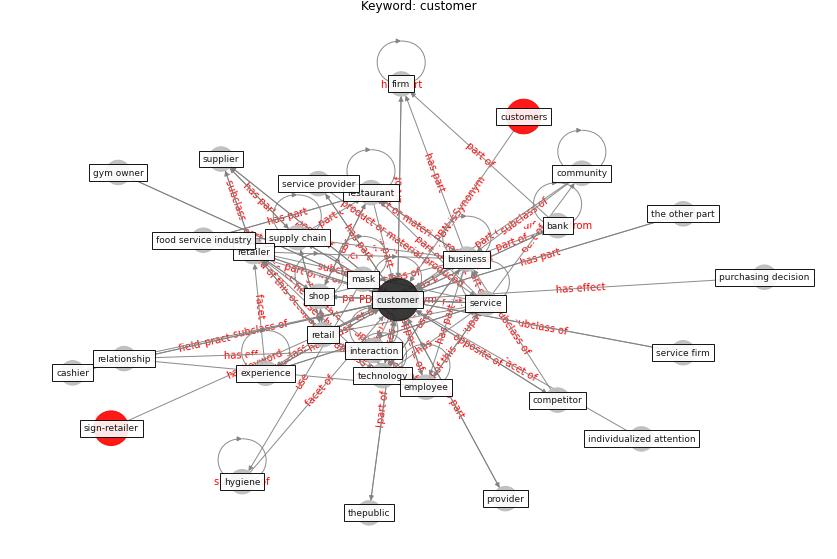

# Keyword: __customer__
## Clusters

* Cluster 5: [space-flexible](cluster_5.md)

## Concepts

 

## Articles
* Retail Signage During the COVID-19 Pandemic ([mcneish_retail_2020](article_mcneish_retail_2020.md))
* realdania_refleksioner_2022_EN-2650 ([realdania_refleksioner_2022_EN-2650](article_realdania_refleksioner_2022_EN-2650.md))
* COVID19: Small and medium enterprises challenges and
responses with creativity, innovation, and
entrepreneurship ([thukral_covid19_2021](article_thukral_covid19_2021.md))
* capgemini_touchless_2020-0 ([capgemini_touchless_2020-0](article_capgemini_touchless_2020-0.md))
* Global value chains: Efficiency and risks in the context
of COVID-19 ([oecd_global_2021](article_oecd_global_2021.md))
* When the fourth water and digital revolution encountered
COVID-19 ([poch_when_2020](article_poch_when_2020.md))
* clifton_covid-19_2020-0 ([clifton_covid-19_2020-0](article_clifton_covid-19_2020-0.md))
* Startups in times of crisis – A rapid response to the
COVID-19 pandemic ([kuckertz_startups_2020](article_kuckertz_startups_2020.md))
* Startups in times of crisis – A rapid response to the
COVID-19 pandemic ([kuckertz_startups_2020](article_kuckertz_startups_2020.md))
* capgemini_touchless_2020-50 ([capgemini_touchless_2020-50](article_capgemini_touchless_2020-50.md))
