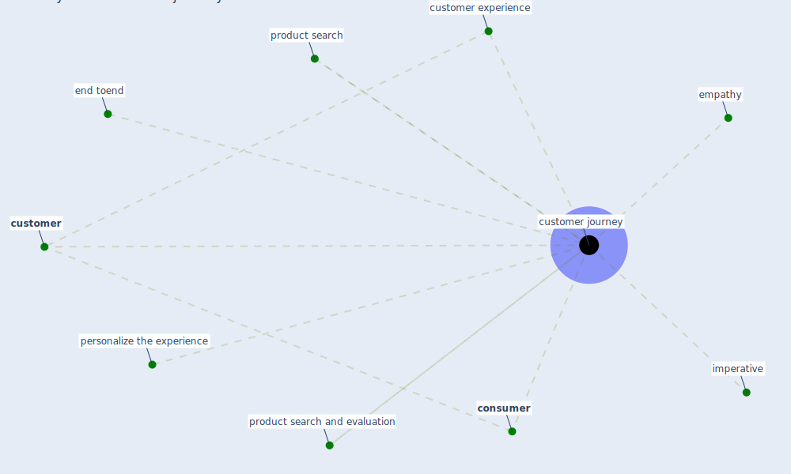

# Keyword: customer journey

## Keywords

 * [consumer](keyword_consumer), [customer](keyword_customer), customer experience, [customer journey](keyword_customer_journey), empathy, end toend, imperative, personalize the experience, product search, product search and evaluation

## Mapping

## Neighbours

### Closest articles

* Touchless Retail: What the Rest of the World could learn from China’s new ways to shop - [LINK](article_capgemini_touchless_2020)
* How COVID-19 Could Accelerate the Adoption of New Retail Technologies and Enhance the (E-)Servicescape - [LINK](article_willems_how_2021)

### Closest BPs

