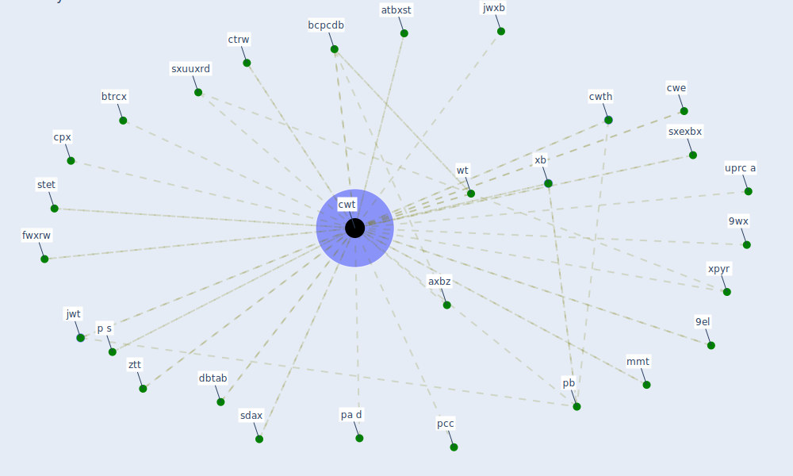

# Keyword: cwt

## Keywords

 * 9el, 9wx, atbxst, axbz, bcpcdb, btrcx, cpx, ctrw, cwe, [cwt](keyword_cwt), cwth, dbtab, fwxrw, [jwt](keyword_jwt), jwxb, mmt, p s, pa d, [pb](keyword_pb), pcc, sdax, stet, sxexbx, sxuuxrd, uprc a, wt, xb, xpyr, ztt

## Mapping

## Neighbours

### Closest articles

* A Platform for Citizen Cooperation during the COVID-19 Pandemic in RN, Brazil - [LINK](article_de_araujo_platform_2020)

### Closest BPs

