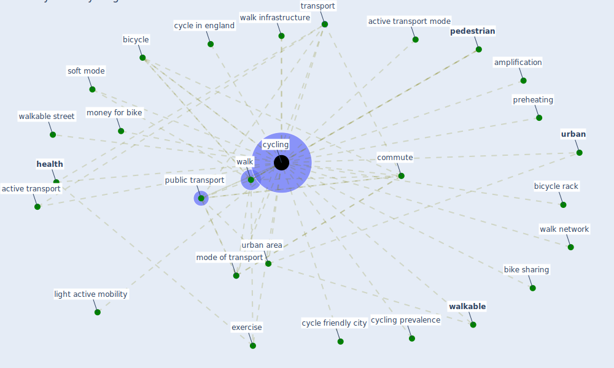

# Keyword: cycling

## Keywords

 * active transport, active transport mode, amplification, bicycle, bicycle rack, bike sharing, commute, cycle friendly city, cycle in england, [cycling](keyword_cycling), cycling prevalence, exercise, [health](keyword_health), light active mobility, mode of transport, money for bike, [pedestrian](keyword_pedestrian), preheating, [public transport](keyword_public_transport), soft mode, [transport](keyword_transport), [urban](keyword_urban), urban area, walk, walk infrastructure, walk network, [walkable](keyword_walkable), walkable street

## Mapping

## Neighbours

### Closest articles

* Urban planning after COVID-19 - [LINK](article_rtpi_urban_2021)
* Responsible Transport: A post-COVID agenda for transport policy and practice - [LINK](article_budd_responsible_2020)
* Antivirus-built environment: Lessons learned from Covid-19 pandemic - [LINK](article_megahed_antivirus-built_2020)
* Health, Wellbeing \& Productivity in Offices - [LINK](article_world_green_building_council_health_2014)
* The COVID-19 pandemic: Impacts on cities and major lessons for urban planning, design, and management - [LINK](article_sharifi_covid-19_2020)
* Mobility Behaviour in View of the Impact of the COVID-19 Pandemic—Public Transport Users in Gdansk Case Study - [LINK](article_przybylowski_mobility_2021)
* Covid-19 and the politics of sustainable energy transitions - [LINK](article_kuzemko_covid-19_2020)
* Study of COVID-19 pandemic in London (UK) from urban context - [LINK](article_ghosh_study_2020)
* The Impact of COVID-19 on Public Space: A Review of the Emerging Questions - [LINK](article_honey-roses_impact_2020)
* SARS-CoV-2 RNA in wastewater anticipated COVID-19 occurrence in a low prevalence area - [LINK](article_randazzo_sars-cov-2_2020)

### Closest BPs

