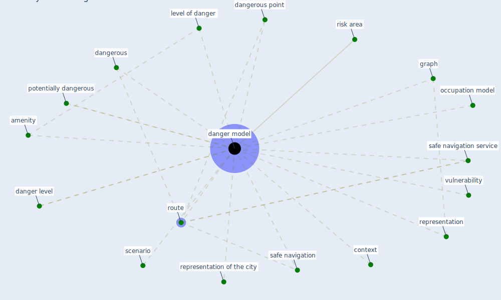

# Keyword: danger model

## Keywords

 * [amenity](keyword_amenity), context, danger level, [danger model](keyword_danger_model), dangerous, dangerous point, graph, level of danger, occupation model, potentially dangerous, representation, representation of the city, risk area, [route](keyword_route), safe navigation, safe navigation service, scenario, [vulnerability](keyword_vulnerability)

## Mapping

## Neighbours

### Closest articles

* COVID19-Routes: A Safe Pedestrian Navigation Service - [LINK](article_cantarero_covid19-routes_2021)

### Closest BPs

