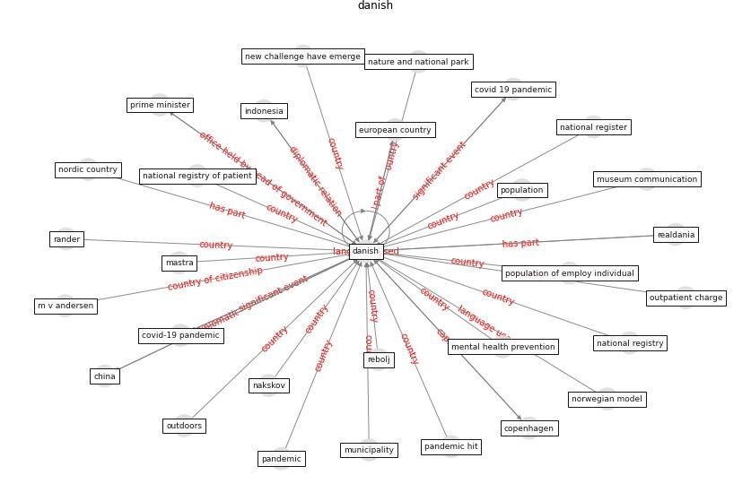

# Keyword: __danish__
## Clusters

* Cluster 13: [robot-drone](cluster_13)

## Concepts

 

## Top 10 articles for __danish__
* realdania_refleksioner_2022_EN ([realdania_refleksioner_2022_EN](article_realdania_refleksioner_2022_EN))
* Mental health economics: A prospective study on
psychological flourishing and associations with healthcare
costs and sickness benefit transfers in Denmark ([santini_mental_2021](article_santini_mental_2021))
* Assessment of Building Automation and Control
Systems in Danish Healthcare Facilities in the
COVID-19 Era ([pedersen_assessment_2022](article_pedersen_assessment_2022))
* A Comprehensive Review of the COVID-19 Pandemic
and the Role of IoT, Drones, AI, Blockchain, and
5G in Managing its Impact ([chamola_comprehensive_2020](article_chamola_comprehensive_2020))
* realdania_refleksioner_2022 ([realdania_refleksioner_2022](article_realdania_refleksioner_2022))
* council_of_europe_2020_2020 ([council_of_europe_2020_2020](article_council_of_europe_2020_2020))
* Compliance with COVID-19 Mitigation Measures in the
United States ([van_rooij_compliance_2020](article_van_rooij_compliance_2020))
* Assessment method for new sustainability indicators
providing pandemic resilience for residential buildings ([tokazhanov_assessment_2021](article_tokazhanov_assessment_2021))
* The Intelligent Lockdown: Compliance with COVID-19
Mitigation Measures in the Netherlands ([kuiper_intelligent_2020](article_kuiper_intelligent_2020))
* The impacts of knowledge, risk perception, emotion and
information on citizens’ protective behaviors during the
outbreak of COVID-19: a cross-sectional study in
China ([ning_impacts_2020](article_ning_impacts_2020))
