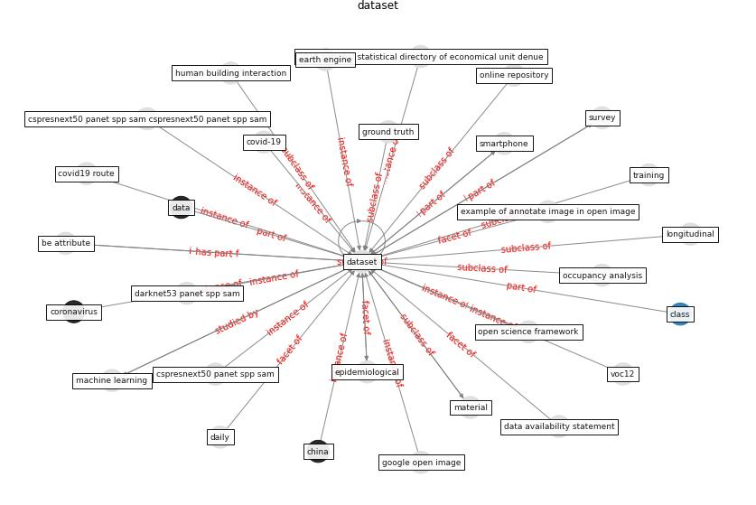

# Keyword: __dataset__
## Clusters

* Cluster 1: [om-ai](cluster_1.md)

## Concepts

 

## Articles
* DeepSOCIAL: Social Distancing Monitoring and
Infection Risk Assessment in COVID-19 Pandemic ([rezaei_deepsocial_2020](article_rezaei_deepsocial_2020.md))
* COVID-19 Higher Mortality in Chinese Regions
With Chronic Exposure to Lower Air Quality ([pansini_covid-19_2021](article_pansini_covid-19_2021.md))
* Pandemic Analytics: How Countries are Leveraging
Big Data Analytics and Artificial Intelligence to
Fight COVID-19? ([mehta_pandemic_2021](article_mehta_pandemic_2021.md))
* Continuous IEQ monitoring system: Context and
development ([parkinson_continuous_2019](article_parkinson_continuous_2019.md))
* DeepSOCIAL: Social Distancing Monitoring and
Infection Risk Assessment in COVID-19 Pandemic ([rezaei_deepsocial_2020](article_rezaei_deepsocial_2020.md))
* RUDDS_bioRxiv_update-0 ([RUDDS_bioRxiv_update-0](article_RUDDS_bioRxiv_update-0.md))
* A Global Survey of Infection Control and
Mitigation Measures for Combating the Transmission
of COVID-19 Pandemic in Buildings Under
Facilities Management Services ([sarvari_global_2022](article_sarvari_global_2022.md))
* Understanding the role of urban design in disease
spreading ([brizuela_understanding_2019](article_brizuela_understanding_2019.md))
* A Global Survey of Infection Control and
Mitigation Measures for Combating the Transmission
of COVID-19 Pandemic in Buildings Under
Facilities Management Services ([sarvari_global_2022](article_sarvari_global_2022.md))
* Open-source analytics tools for studying the COVID-19
coronavirus outbreak ([wu_open-source_2020](article_wu_open-source_2020.md))
