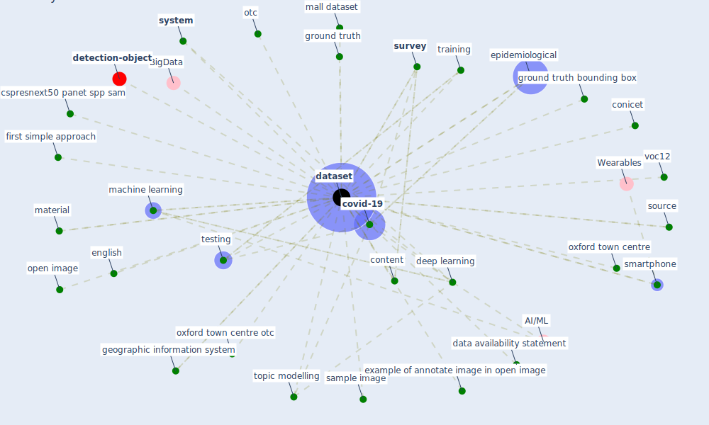

# Keyword: dataset

## Keywords

 * BigData, air quality, anacode, analysis model, arelarger sample size, base model, be attribute, [big datum](keyword_big_datum), case based risk mapping, cdr, [china](keyword_china), class, colla bia, complex, conicet, consistent, content, content column, [coronavirus](keyword_coronavirus), [covid-19](keyword_covid-19), covid19 route, cspresnext50 panet spp sam, cspresnext50 panet spp sam cspresnext50 panet spp sam, daily, darknet53 panet spp sam, data availability statement, database, [dataset](keyword_dataset), datasets, [datum](keyword_datum), dedicated repository, [deep learning](keyword_deep_learning), earth engine, english, [epidemiological](keyword_epidemiological), example of annotate image in open image, excel, finding, first simple approach, geographic information system, goi, google open image, government response measure, ground truth, ground truth bounding box, grump ue, gtopo30, human building interaction, landcover, line list, longitudinal, [machine learning](keyword_machine_learning), mall, mall dataset, [material](keyword_material), median hourly load, medium article, microsoft coco, ministry of womenand vulnerable population, more comprehensive dataset, ms coco, nextstrain, [occsim](keyword_occsim), occupancy analysis, online repository, open image, open image dataset, open science framework, otc, oxford town centre, oxford town centre otc, population density, repository, risk mapping, [sample](keyword_sample), sample image, [smartphone](keyword_smartphone), source, [survey](keyword_survey), [system](keyword_system), testing, [topic modelling](keyword_topic_modelling), [training](keyword_training), voc12

## Mapping

## Neighbours

### Closest articles

* DeepSOCIAL: Social Distancing Monitoring and Infection Risk Assessment in COVID-19 Pandemic - [LINK](article_rezaei_deepsocial_2020)
* Exploring the Non-Medical impacts of Covid-19 using Natural Language Processing - [LINK](article_agade_exploring_2020)
* An Automated System to Limit COVID-19 Using Facial Mask Detection in Smart City Network - [LINK](article_rahman_automated_2020)
* Integrating rapid risk mapping and mobile phone call record data for strategic malaria elimination planning - [LINK](article_tatem_integrating_2014)
* Urban design attributes and resilience: COVID-19 evidence from New York City - [LINK](article_yang_urban_2021)
* Towards the sustainable development of smart cities through mass video surveillance: A response to the COVID-19 pandemic - [LINK](article_shorfuzzaman_towards_2021)
* A Global Survey of Infection Control and Mitigation Measures for Combating the Transmission of COVID-19 Pandemic in Buildings Under Facilities Management Services - [LINK](article_sarvari_global_2022)
* COVID-19 Higher Mortality in Chinese Regions With Chronic Exposure to Lower Air Quality - [LINK](article_pansini_covid-19_2021)
* Pandemic Analytics: How Countries are Leveraging Big Data Analytics and Artificial Intelligence to Fight COVID-19? - [LINK](article_mehta_pandemic_2021)
* Digital Twin of COVID-19 Mass Vaccination Centers - [LINK](article_pilati_digital_2021)

### Closest BPs

