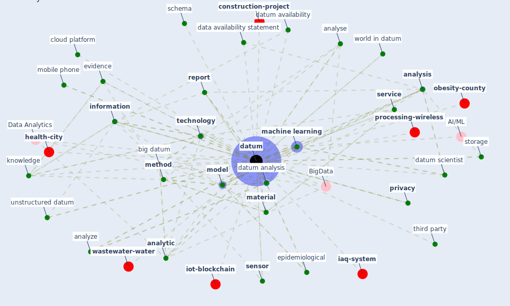

# Keyword: datum

* [urban-city](cluster_4)

* [ontology-datum](cluster_5)

* [datum-iot](cluster_6)

* [china-case](cluster_7)

* [water-wastewater](cluster_12)

## Keywords

 * analyse, [analysis](keyword_analysis), [analytic](keyword_analytic), analyze, api, assessment, authoritative information, [big datum](keyword_big_datum), big datum analytic, [blockchain](keyword_blockchain), causality analysis, census, cloud, cloud platform, collateral, collect, computer science, computer scientist, confidential, data availability statement, database, [datum](keyword_datum), datum acquisition, datum analysis, datum availability, datum everywhere, datum scientist, datum structure, document, empirical, [epidemiological](keyword_epidemiological), [evidence](keyword_evidence), excel sheet, formidle analyser, geolocation, github, health condition, health datum, heuristic, hypothesis, [information](keyword_information), insight, integrate, [integration](keyword_integration), [internet of thing](keyword_internet_of_thing), interview, [knowledge](keyword_knowledge), life science, machine learning, manage, material, memory, mendeley, method, mobile phone, [model](keyword_model), modeller, nchs, [ontology](keyword_ontology), open datum, operation, operator, organization, outcome metric, [pandemic](keyword_pandemic), [pandemien](keyword_pandemien), perception, predict, [privacy](keyword_privacy), privacy concern, report, [research](keyword_research), [researcher](keyword_researcher), [sample](keyword_sample), schema, science, scientist, sense, sensitive, [sensor](keyword_sensor), [service](keyword_service), [smart building](keyword_smart_building), smartphone, software, software application, [solution](keyword_solution), statistic, statistical, storage, strength, subjective judgment, [surveillance](keyword_surveillance), [technology](keyword_technology), telecommunication, test, third party, unstructured datum, urban informatic, wearable device, world in datum

## Mapping

## Neighbours

### Closest articles

* World Bank Development Report - [LINK](article_world_bank_world_2022)
* Impact of COVID-19 on IoT Adoption in Healthcare, Smart Homes, Smart Buildings, Smart Cities, Transportation and Industrial IoT - [LINK](article_umair_impact_2021)
* Pandemic Analytics: How Countries are Leveraging Big Data Analytics and Artificial Intelligence to Fight COVID-19? - [LINK](article_mehta_pandemic_2021)
* Continuous IEQ monitoring system: Context and development - [LINK](article_parkinson_continuous_2019)
* Guidelines for resilience systems analysis - [LINK](article_oecd_guidelines_2014)
* Refleksioner fra en pandemi - [LINK](article_realdania_refleksioner_2022)
* Scalable IoT Architecture for Monitoring IEQ Conditions in Public and Private Buildings - [LINK](article_calvo_scalable_2022)
* 2020 Data Protection Report - [LINK](article_council_of_europe_2020_2020)
* The Emergence of Anti-Privacy and Control at the Nexus between the Concepts of Safe City and Smart City - [LINK](article_allam_emergence_2019)
* Digital Twin of COVID-19 Mass Vaccination Centers - [LINK](article_pilati_digital_2021)

### Closest BPs

