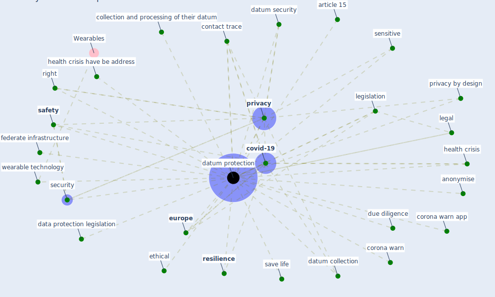

# Keyword: datum protection

## Keywords

 * anonymise, article 15, collection and processing of their datum, contact trace, corona warn, corona warn app, [covid-19](keyword_covid-19), data protection, data protection legislation, datum collection, [datum protection](keyword_datum_protection), datum security, due diligence, ethical, [europe](keyword_europe), federate infrastructure, health crisis, health crisis have be address, legal, legislation, [privacy](keyword_privacy), privacy by design, [resilience](keyword_resilience), right, [safety](keyword_safety), save life, [security](keyword_security), sensitive, wearable technology

## Mapping

## Neighbours

### Closest articles

* 2020 Data Protection Report - [LINK](article_council_of_europe_2020_2020)
* Health Information Exchange with Blockchain amid Covid-19-like Pandemics - [LINK](article_christodoulou_health_2020)
* Challenges of data sharing in European Covid-19 projects: A learning opportunity for advancing pandemic preparedness and response - [LINK](article_tacconelli_challenges_2022)
* Validity of energy social research during and after COVID-19: challenges, considerations, and responses - [LINK](article_fell_validity_2020)
* Pandemic Analytics: How Countries are Leveraging Big Data Analytics and Artificial Intelligence to Fight COVID-19? - [LINK](article_mehta_pandemic_2021)
* The Emergence of Anti-Privacy and Control at the Nexus between the Concepts of Safe City and Smart City - [LINK](article_allam_emergence_2019)
* Mobile Technology Solution for COVID-19: Surveillance and Prevention - [LINK](article_raza_mobile_2021)
* COVID-19 and a new resilient infrastructure landscape - [LINK](article_oecd_covid-19_2021)
* World Bank Development Report - [LINK](article_world_bank_world_2022)

### Closest BPs

