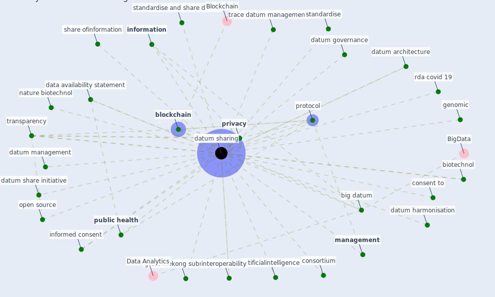

# Keyword: datum sharing

## Keywords

 * artificialintelligence, [big datum](keyword_big_datum), biotechnol, [blockchain](keyword_blockchain), [consent](keyword_consent), consent to, consortium, data availability statement, data governance framework, data sharing, [datum](keyword_datum), datum architecture, datum governance, datum harmonisation, datum management, datum share initiative, [datum sharing](keyword_datum_sharing), federated datum analysis, genomic, great mekong subregion, [information](keyword_information), informed consent, interoperability, [management](keyword_management), nature biotechnol, open source, [privacy](keyword_privacy), [protocol](keyword_protocol), [public health](keyword_public_health), rda covid 19, share ofinformation, standardise, standardise and share datum, trace datum management, transparency

## Mapping

## Neighbours

### Closest articles

* Challenges of data sharing in European Covid-19 projects: A learning opportunity for advancing pandemic preparedness and response - [LINK](article_tacconelli_challenges_2022)
* On the Coronavirus (COVID-19) Outbreak and the Smart City Network: Universal Data Sharing Standards Coupled with Artificial Intelligence (AI) to Benefit Urban Health Monitoring and Management - [LINK](article_allam_coronavirus_2020)
* The role of 5G for digital healthcare against COVID-19 pandemic: Opportunities and challenges - [LINK](article_siriwardhana_role_2021)
* Pandemic Analytics: How Countries are Leveraging Big Data Analytics and Artificial Intelligence to Fight COVID-19? - [LINK](article_mehta_pandemic_2021)
* A Review on Building Design as a Biomedical System for Preventing COVID-19 Pandemic - [LINK](article_amran_review_2022)
* Blockchain technology and its applications to combat COVID-19 pandemic - [LINK](article_sharma_blockchain_2022)
* Impact of COVID-19 on IoT Adoption in Healthcare, Smart Homes, Smart Buildings, Smart Cities, Transportation and Industrial IoT - [LINK](article_umair_impact_2021)
* Mobility Behaviour in View of the Impact of the COVID-19 Pandemic—Public Transport Users in Gdansk Case Study - [LINK](article_przybylowski_mobility_2021)
* World Bank Development Report - [LINK](article_world_bank_world_2022)
* CIDO, a community-based ontology for coronavirus disease knowledge and data integration, sharing, and analysis - [LINK](article_he_cido_2020)

### Closest BPs

