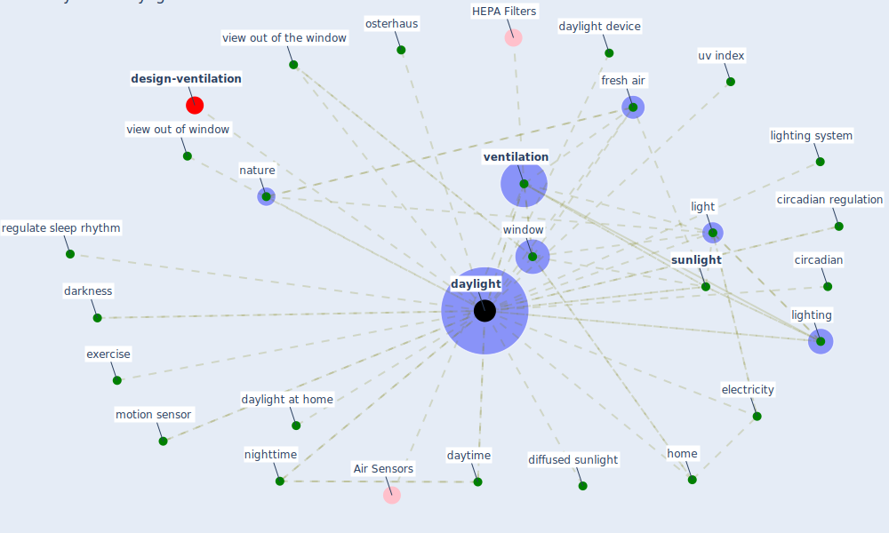

# Keyword: daylight

* [design-ventilation](cluster_12)

## Keywords

 * Cluster_12, circadian, circadian regulation, darkness, [daylight](keyword_daylight), daylight at home, daylight device, daytime, diffused sunlight, electricity, exercise, fresh air, [home](keyword_home), light, lighting, lighting system, motion sensor, [nature](keyword_nature), nighttime, osterhaus, regulate sleep rhythm, [sunlight](keyword_sunlight), uv index, [ventilation](keyword_ventilation), view out of the window, view out of window, [window](keyword_window)

## Mapping

## Neighbours

### Closest articles

* Health, Wellbeing \& Productivity in Offices - [LINK](article_world_green_building_council_health_2014)
* Architectural design strategies for infection prevention and control (IPC) in health-care facilities: towards curbing the spread of Covid-19 \textbar SpringerLink - [LINK](article_udomiaye_architectural_2020)
* How our homes impact our health: using a COVID-19 informed approach to examine urban apartment housing - [LINK](article_peters_how_2020)
* A Review on Building Design as a Biomedical System for Preventing COVID-19 Pandemic - [LINK](article_amran_review_2022)
* Readiness Assessment of Green Building Certification Systems for Residential Buildings during Pandemics - [LINK](article_tleuken_readiness_2021)
* Adaptive Design of the Built Environment to Mitigate the Transmission Risk of COVID-19 - [LINK](article_ara_dilshad_shangi_adaptive_2020)
* Assessment of Building Automation and Control Systems in Danish Healthcare Facilities in the COVID-19 Era - [LINK](article_pedersen_assessment_2022)
* Occupants’ behavior and activity patterns influencing the energy consumption in the Kuwaiti residences - [LINK](article_al-mumin_occupants_2003)
* Ten questions concerning occupant health in buildings during normal operations and extreme events including the COVID-19 pandemic - [LINK](article_awada_ten_2021)
* Prophylactic Architecture: Formulating the Concept of Pandemic-Resilient Homes - [LINK](article_elrayies_prophylactic_2022)

### Closest BPs

