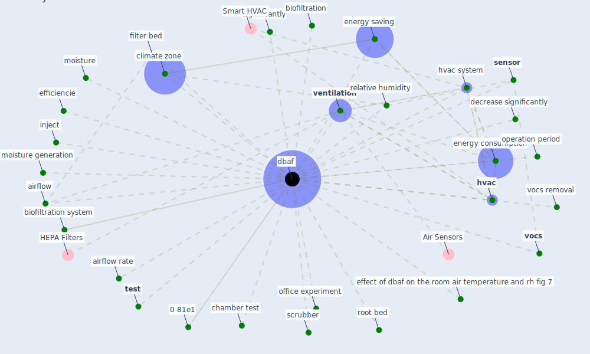

# Keyword: dbaf

## Keywords

 * 0 81e1, 8 h operation period, airflow, airflow rate, biofiltration, biofiltration system, chamber test, climate zone, continuously monitor, [dbaf](keyword_dbaf), decrease significantly, effect of dbaf on the room air temperature and rh fig 7, efficiencie, [energy consumption](keyword_energy_consumption), energy saving, [hvac](keyword_hvac), [hvac system](keyword_hvac_system), inject, moisture, moisture generation, office experiment, operation period, relative humidity, root bed, scrubber, [sensor](keyword_sensor), significantly, [test](keyword_test), [ventilation](keyword_ventilation), [vocs](keyword_vocs), vocs removal, filter bed

## Mapping

## Neighbours

### Closest articles

* Characterization and performance evaluation of a full-scale activated carbon-based dynamic botanical air filtration system for improving indoor air quality - [LINK](article_wang_characterization_2011)

### Closest BPs

