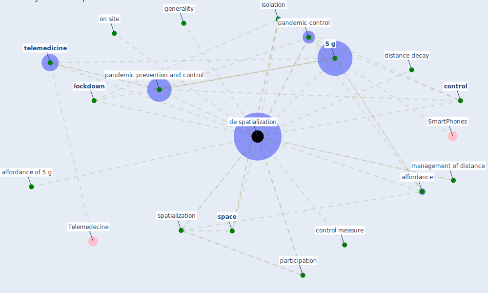

# Keyword: de spatialization

## Keywords

 * [5 g](keyword_5_g), affordance, affordance of 5 g, [control](keyword_control), control measure, [de spatialization](keyword_de_spatialization), distance decay, generality, isolation, [lockdown](keyword_lockdown), management of distance, on site, pandemic control, [pandemic prevention and control](keyword_pandemic_prevention_and_control), participation, [space](keyword_space), spatialization, [telemedicine](keyword_telemedicine)

## Mapping

## Neighbours

### Closest articles

* Design COVID-19 Ontology: A Healthcare and Safety Perspective - [LINK](article_aloulou_design_2022)
* How the 5G Enabled the COVID-19 Pandemic Prevention and Control: Materiality, Affordance, and (De-)Spatialization - [LINK](article_li_how_2022)

### Closest BPs

