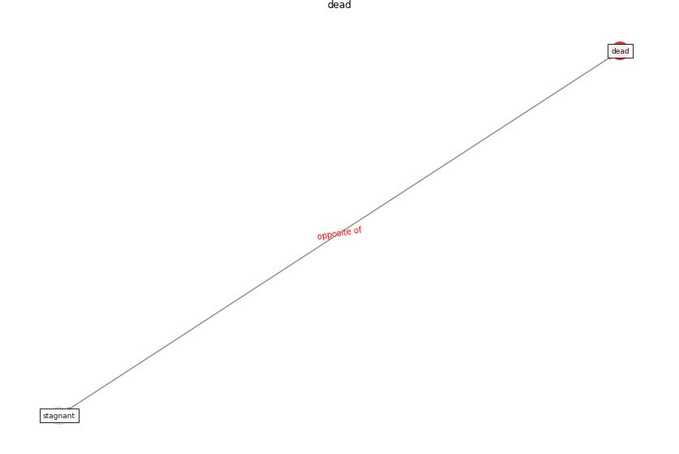

# Keyword: __dead__
## Clusters

* Cluster 5: [space-flexible](cluster_5.md)

## Concepts

 

## Articles
* The ventilation of buildings and other mitigating measures
for COVID-19: a focus on wintertime ([burridge_ventilation_2021](article_burridge_ventilation_2021.md))
* RUDDS_bioRxiv_update-0 ([RUDDS_bioRxiv_update-0](article_RUDDS_bioRxiv_update-0.md))
* realdania_refleksioner_2022_EN-1100 ([realdania_refleksioner_2022_EN-1100](article_realdania_refleksioner_2022_EN-1100.md))
* realdania_refleksioner_2022_EN-1450 ([realdania_refleksioner_2022_EN-1450](article_realdania_refleksioner_2022_EN-1450.md))
* realdania_refleksioner_2022_EN-1400 ([realdania_refleksioner_2022_EN-1400](article_realdania_refleksioner_2022_EN-1400.md))
* realdania_refleksioner_2022_EN-1350 ([realdania_refleksioner_2022_EN-1350](article_realdania_refleksioner_2022_EN-1350.md))
* realdania_refleksioner_2022_EN-1300 ([realdania_refleksioner_2022_EN-1300](article_realdania_refleksioner_2022_EN-1300.md))
* realdania_refleksioner_2022_EN-1250 ([realdania_refleksioner_2022_EN-1250](article_realdania_refleksioner_2022_EN-1250.md))
* realdania_refleksioner_2022_EN-1200 ([realdania_refleksioner_2022_EN-1200](article_realdania_refleksioner_2022_EN-1200.md))
* realdania_refleksioner_2022_EN-1150 ([realdania_refleksioner_2022_EN-1150](article_realdania_refleksioner_2022_EN-1150.md))
