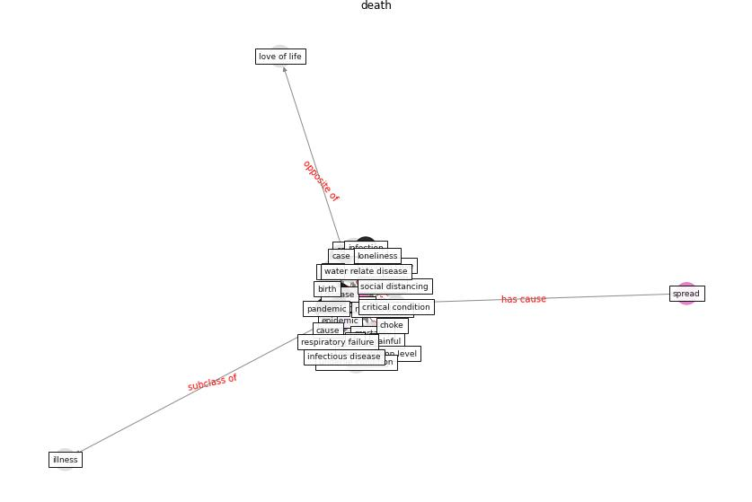

# Keyword: __death__
## Clusters

* Cluster 9: [climate-change](cluster_9)

## Concepts

 

## Top 10 articles for __death__
* The socio-economic determinants of COVID-19: A spatial
analysis of German county level data ([ehlert_socio-economic_2021](article_ehlert_socio-economic_2021))
* COVID-ABS: An agent-based model of COVID-19
epidemic to simulate health and economic effects of social
distancing interventions ([silva_covid-abs_2020](article_silva_covid-abs_2020))
* Coronavirus disease 2019: The harms of exaggerated
information and non‐evidence‐based measures ([ioannidis_coronavirus_2020](article_ioannidis_coronavirus_2020))
* How loneliness is talked about in social media during
COVID-19 pandemic: Text mining of 4,492 Twitter
feeds ([koh_how_2022](article_koh_how_2022))
* Management of the COVID-19 pandemic: challenges,
practices, and organizational support ([hossny_management_2022](article_hossny_management_2022))
* What has been the impact of the COVID-19 pandemic on
immigrants? An update on recent evidence ([oecd_what_2022](article_oecd_what_2022))
* Health, Economic and Social Development Challenges
of the COVID-19 Pandemic: Strategies for Multiple
and Interconnected Issues ([panneer_health_2022](article_panneer_health_2022))
* rtpi_urban_2021 ([rtpi_urban_2021](article_rtpi_urban_2021))
* Leveraging Digital Transformation Technologies to
Tackle COVID-19: Proposing a Privacy-First
Holistic Framework ([arpaci_leveraging_2021](article_arpaci_leveraging_2021))
* Wastewater surveillance for population-wide Covid-19:
The present and future ([daughton_wastewater_2020](article_daughton_wastewater_2020))
