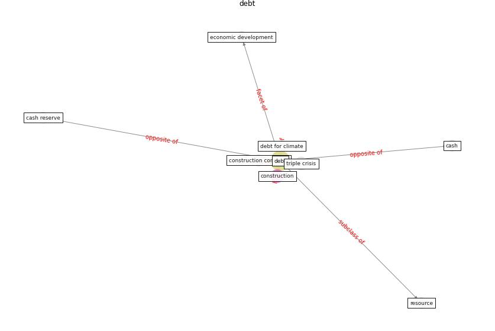

# Keyword: __debt__
## Clusters

* Cluster 13: [resilience-sme](cluster_13)

## Concepts

 

## Articles
* rtpi_urban_2021 ([rtpi_urban_2021](article_rtpi_urban_2021))
* Mechanisms for addressing the impact of COVID-19 on
infrastructure projects ([king_mechanisms_2021](article_king_mechanisms_2021))
* Guidelines for Responding to COVID-19 Pandemic:
Best Practices, Impacts, and Future Research
Directions ([assaad_guidelines_2021](article_assaad_guidelines_2021))
* Borders and Catastrophe: lessons from COVID-19 for the
European Green Deal ([klein_borders_2021](article_klein_borders_2021))
* EXPOSED: An occupant exposure model for confined
spaces to retrofit crowd models during a pandemic ([ronchi_exposed_2020](article_ronchi_exposed_2020))
* Mobility Behaviour in View of the Impact of the
COVID-19 Pandemic—Public Transport Users in
Gdansk Case Study ([przybylowski_mobility_2021](article_przybylowski_mobility_2021))
* Effects to Construction Project Management
Impacted Circular Economic of Covid-19 Pandemic ([paikan_effects_2021](article_paikan_effects_2021))
* Impacts of COVID-19 on Health and Safety of
Workforce in Construction Industry ([pamidimukkala_impacts_2021](article_pamidimukkala_impacts_2021))
* Health, Economic and Social Development Challenges
of the COVID-19 Pandemic: Strategies for Multiple
and Interconnected Issues ([panneer_health_2022](article_panneer_health_2022))
* COVID-19 Higher Mortality in Chinese Regions
With Chronic Exposure to Lower Air Quality ([pansini_covid-19_2021](article_pansini_covid-19_2021))
