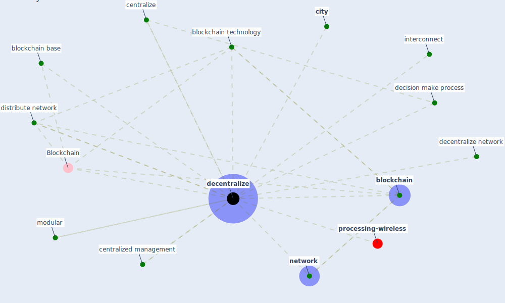

# Keyword: decentralize

* [processing-wireless](cluster_14)

## Keywords

 * Blockchain, Cluster_14, [blockchain](keyword_blockchain), blockchain base, [blockchain technology](keyword_blockchain_technology), centralize, centralized management, [city](keyword_city), [decentralize](keyword_decentralize), decentralize network, decentralized, decision make process, distribute network, interconnect, modular, [network](keyword_network)

## Mapping

## Neighbours

### Closest articles

* Learning from the COVID-19 pandemic in governing smart cities - [LINK](article_bolivar_learning_2022)
* Blockchain technology and its applications to combat COVID-19 pandemic - [LINK](article_sharma_blockchain_2022)
* Health Information Exchange with Blockchain amid Covid-19-like Pandemics - [LINK](article_christodoulou_health_2020)
* The Impact of COVID-19 on Public Space: A Review of the Emerging Questions - [LINK](article_honey-roses_impact_2020)
* The role of 5G for digital healthcare against COVID-19 pandemic: Opportunities and challenges - [LINK](article_siriwardhana_role_2021)
* Urban design attributes and resilience: COVID-19 evidence from New York City - [LINK](article_yang_urban_2021)

### Closest BPs

