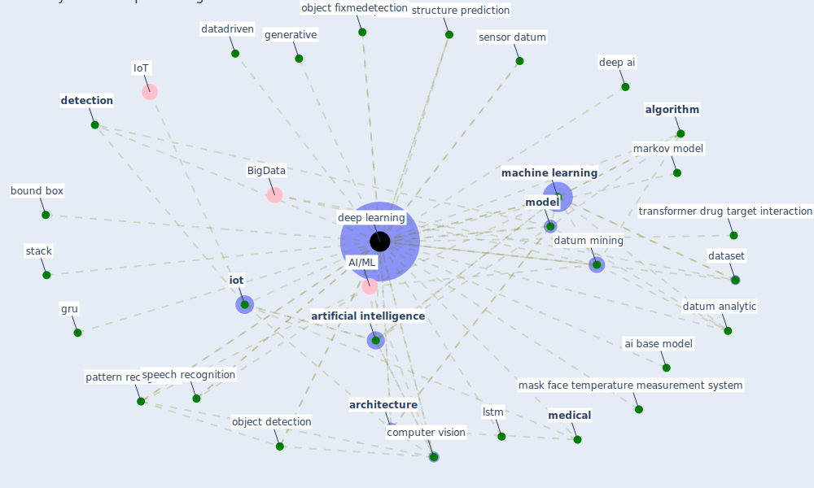

# Keyword: deep learning

## Keywords

 * 25 alpha fold, 3d deep learning framework, AI/ML, ai algorithm, ai base model, [algorithm](keyword_algorithm), [analysis](keyword_analysis), [architecture](keyword_architecture), [artificial intelligence](keyword_artificial_intelligence), baidu, [bound box](keyword_bound_box), [chatbot](keyword_chatbot), [computer vision](keyword_computer_vision), [covid-19](keyword_covid-19), datadriven, [dataset](keyword_dataset), datum analytic, datum mining, deep ai, [deep learning](keyword_deep_learning), deep learning subj transfer learning, [detection](keyword_detection), detection and diagnosis, detection and diagnosis of covid 19, diagnosis and treatment, edge computing, energy 181, face mask, forecasting, generative, generic object detection, gru, hassabis, ieee情access, ieee能access, image processing, indoor air quality analysis, [iot](keyword_iot), knowledge graph, [lda](keyword_lda), [learn](keyword_learn), lstm, [machine learning](keyword_machine_learning), markov model, markov modelbase machine, [mask](keyword_mask), mask face temperature measurement system, [medical](keyword_medical), [model](keyword_model), object and people detection, [object detection](keyword_object_detection), object detection model, object fixmedetection, object tamadradetection, paddlepaddle, pattern recognition, [prediction](keyword_prediction), protein structure prediction, sensor datum, speech recognition, stack, [surveillance](keyword_surveillance), [system](keyword_system), [topic modelling](keyword_topic_modelling), transformer drug target interaction, videosurveillance

## Mapping

## Neighbours

### Closest articles

* An Automated System to Limit COVID-19 Using Facial Mask Detection in Smart City Network - [LINK](article_rahman_automated_2020)
* Exploring the Potential of Artificial Intelligence and Machine Learning to Combat COVID-19 and Existing Opportunities for LMIC: A Scoping Review - [LINK](article_naseem_exploring_2020)
* Towards the sustainable development of smart cities through mass video surveillance: A response to the COVID-19 pandemic - [LINK](article_shorfuzzaman_towards_2021)
* A comprehensive review on indoor air quality monitoring systems for enhanced public health - [LINK](article_saini_comprehensive_2020)
* DeepSOCIAL: Social Distancing Monitoring and Infection Risk Assessment in COVID-19 Pandemic - [LINK](article_rezaei_deepsocial_2020)
* A Comprehensive Review of the COVID-19 Pandemic and the Role of IoT, Drones, AI, Blockchain, and 5G in Managing its Impact - [LINK](article_chamola_comprehensive_2020)
* Digital technology and COVID-19 - [LINK](article_ting_digital_2020)
* Pandemic Analytics: How Countries are Leveraging Big Data Analytics and Artificial Intelligence to Fight COVID-19? - [LINK](article_mehta_pandemic_2021)
*  - [LINK](article_huy-tran_design_2022)
* Social distancing enhanced automated optimal design of physical spaces in the wake of the COVID-19 pandemic - [LINK](article_ugail_social_2021)

### Closest BPs

