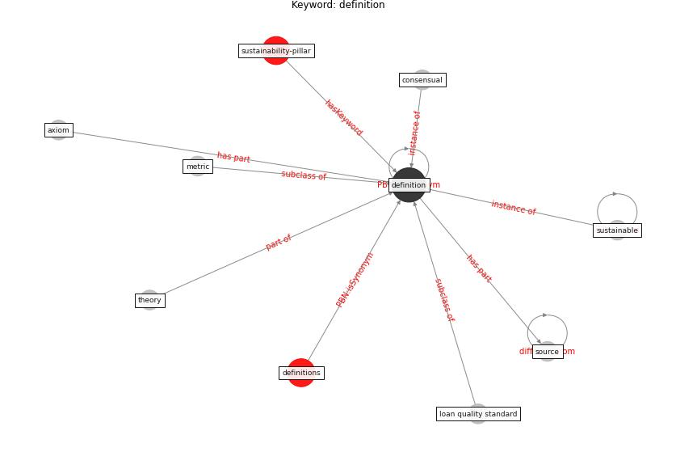

# Keyword: definition

* [sustainability-pillar](cluster_Cluster_0)

## Keywords

 * Cluster_0, axiom, consensual, [definition](keyword_definition), definitions, loan quality standard, metric, source, [sustainable](keyword_sustainable), theory

## Concepts

 

## Neighbours

### Closest articles

* Design COVID-19 Ontology: A Healthcare and Safety Perspective - [LINK](article_aloulou_design_2022)
* How the 5G Enabled the COVID-19 Pandemic Prevention and Control: Materiality, Affordance, and (De-)Spatialization - [LINK](article_li_how_2022)
* The COVID-19 epidemiology and monitoring ontology - [LINK](article_queralt-rosinach_covid-19_2021)
* World Bank Development Report - [LINK](article_world_bank_world_2022)
* COVID-19 and the rise of intimate partner violence - [LINK](article_aguero_covid-19_2021)
* Occupant health in buildings: Impact of the COVID-19 pandemic on the opinions of building professionals and implications on research - [LINK](article_awada_occupant_2022)
* Continuous IEQ monitoring system: Context and development - [LINK](article_parkinson_continuous_2019)
* COVID-19: IMPACT OF THE PANDEMIC ON THE SUSTAINABLE DEVELOPMENT GOALS - [LINK](article_samout_covid-19_2020)

### Closest BPs

