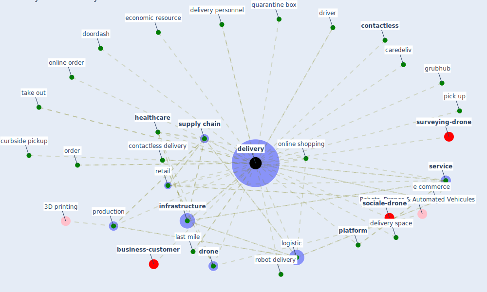

# Keyword: delivery

* [business-customer](cluster_6)

* [surveying-drone](cluster_11)

* [sociale-drone](cluster_13)

## Keywords

 * Cluster_11, Cluster_13, Cluster_6, amigo day, caredeliv, [contactless](keyword_contactless), contactless delivery, curbside pickup, customer pick up, deliveries, [delivery](keyword_delivery), delivery 110 k willem, delivery 110 k willem et the delivery of grocery, delivery personnel, delivery space, deloitte, development, doordash, driver, [drone](keyword_drone), drone startup, e commerce, economic resource, food truck, free delivery, grocery, grubhub, [healthcare](keyword_healthcare), [infrastructure](keyword_infrastructure), infrastructure operation, last mile, last mile delivery, [logistic](keyword_logistic), meal, online order, online ordering, online shopping, order, pick up, [platform](keyword_platform), production, quarantine box, retail, robot delivery, [service](keyword_service), [supply chain](keyword_supply_chain), take out, takeout, [transport](keyword_transport), virus proof, web service

## Mapping

## Neighbours

### Closest articles

* Drones. Disinfecting robots. Supercomputers. The coronavirus outbreak is a test for China's tech industry \textbar CNN Business - [LINK](article_wang_drones_2020)
* How COVID-19 Could Accelerate the Adoption of New Retail Technologies and Enhance the (E-)Servicescape - [LINK](article_willems_how_2021)
* Touchless Retail: What the Rest of the World could learn from China’s new ways to shop - [LINK](article_capgemini_touchless_2020)
* 10 tech trends getting us through the COVID-19 pandemic - [LINK](article_yan_10_2020)
* A critical analysis of the impacts of COVID-19 on the global economy and ecosystems and opportunities for circular economy strategies - [LINK](article_ibn-mohammed_critical_2021)
* A Comprehensive Review of the COVID-19 Pandemic and the Role of IoT, Drones, AI, Blockchain, and 5G in Managing its Impact - [LINK](article_chamola_comprehensive_2020)
* Urban planning after COVID-19 - [LINK](article_rtpi_urban_2021)
* COVID-19 and a new resilient infrastructure landscape - [LINK](article_oecd_covid-19_2021)
* Retail Signage During the COVID-19 Pandemic - [LINK](article_mcneish_retail_2020)

### Closest BPs

