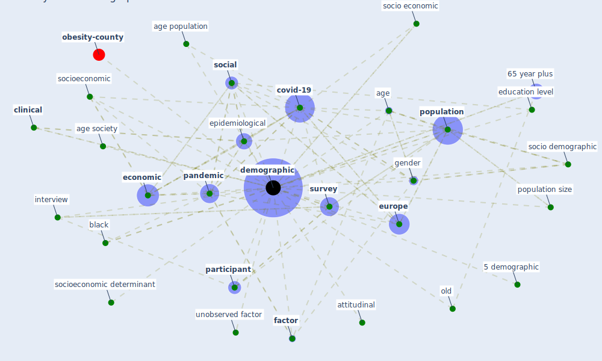

# Keyword: demographic

* [obesity-county](cluster_9)

## Keywords

 * 5 demographic, 65 year plus, Cluster_9, age, age population, age population in some country, age society, attitudinal, black, [clinical](keyword_clinical), [covid-19](keyword_covid-19), [demographic](keyword_demographic), demographics, [economic](keyword_economic), education level, [epidemiological](keyword_epidemiological), [europe](keyword_europe), [factor](keyword_factor), gender, interview, old, [pandemic](keyword_pandemic), [participant](keyword_participant), [population](keyword_population), population size, [social](keyword_social), socio demographic, socio economic, socioeconomic, socioeconomic determinant, [survey](keyword_survey), unobserved factor, [variable](keyword_variable)

## Mapping

## Neighbours

### Closest articles

* Treating two pandemics for the price of one: Chronic and infectious disease impacts of the built and natural environment - [LINK](article_frank_treating_2021)
* Green in times of COVID-19: urban green space relevance during the COVID-19 pandemic in Buenos Aires City - [LINK](article_marconi_green_2022)
* What has been the impact of the COVID-19 pandemic on immigrants? An update on recent evidence - [LINK](article_oecd_what_2022)
* Addressing vulnerability, building resilience: community-based adaptation to vector-borne diseases in the context of global change - [LINK](article_bardosh_addressing_2017)
* Sustainable work throughout the life course: National policies and strategies, Publications Office of the European Union - [LINK](article_eurofund_sustainable_2016)
* What drives unverified information sharing and cyberchondria during the COVID-19 pandemic? - [LINK](article_laato_what_2020)
* COVID-19 and a new resilient infrastructure landscape - [LINK](article_oecd_covid-19_2021)
* SARS-CoV-2 in wastewater: potential health risk, but also data source - [LINK](article_lodder_sars-cov-2_2020)
* The socio-economic determinants of COVID-19: A spatial analysis of German county level data - [LINK](article_ehlert_socio-economic_2021)
* COVID-ABS: An agent-based model of COVID-19 epidemic to simulate health and economic effects of social distancing interventions - [LINK](article_silva_covid-abs_2020)

### Closest BPs

