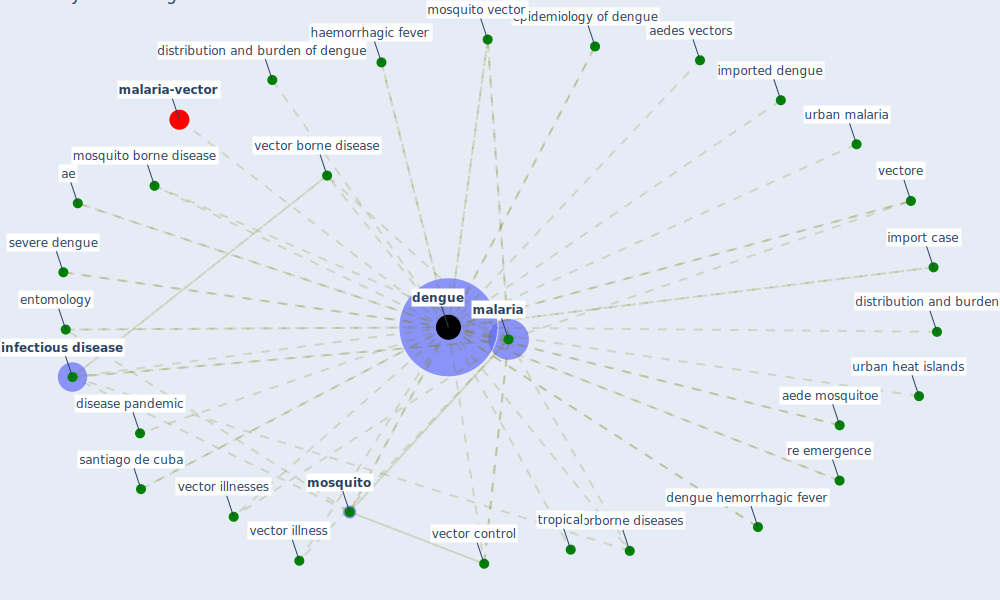

# Keyword: dengue

* [malaria-vector](cluster_13)

## Keywords

 * Cluster_13, ae, aede mosquitoe, aedes vectors, [dengue](keyword_dengue), dengue and severe dengue, dengue hemorrhagic fever, dengue importation, disease pandemic, distribution and burden, distribution and burden of dengue, emerging flaviviruses, entomology, epidemiology of dengue, haemorrhagic fever, import case, imported dengue, imported dengue cases, in 2care, [infectious disease](keyword_infectious_disease), madeira, [malaria](keyword_malaria), [mosquito](keyword_mosquito), mosquito borne disease, mosquito vector, re emergence, re emergence of dengue in china, risk factor, rodó x, santiago de cuba, severe dengue, são paulo urban heat islands, tropical, tropicalッド, uhis, urban heat islands, urban malaria, [vector borne disease](keyword_vector_borne_disease), vector control, vector illness, vector illnesses, vectorborne diseases, vectore

## Mapping

## Neighbours

### Closest articles

* Challenges to Mitigating the Urban Health Burden of Mosquito-Borne Diseases in the Face of Climate Change - [LINK](article_ligsay_challenges_2021)
* Addressing vulnerability, building resilience: community-based adaptation to vector-borne diseases in the context of global change - [LINK](article_bardosh_addressing_2017)
* Prototype Early Warning Systems for Vector-Borne Diseases in Europe - [LINK](article_semenza_prototype_2015)
* Decision Making within the Built Environment as a Strategy for Mitigating the Risk of Malaria and Other Vector-Borne Diseases - [LINK](article_obonyo_decision_2018)
* An Overview of Biomedical Ontologies for Pandemics and Infectious Diseases Representation - [LINK](article_bayoudhi_overview_2021)
* The impact of climate change on the epidemiology and control of Rift Valley fever - PubMed - [LINK](article_martin_impact_2008)
* A critical analysis of the impacts of COVID-19 on the global economy and ecosystems and opportunities for circular economy strategies - [LINK](article_ibn-mohammed_critical_2021)
* The Role of Architecture and Urbanism in Preventing Pandemics - [LINK](article_kumar_role_2021)
* Making green infrastructure healthier infrastructure - [LINK](article_lohmus_making_2015)
* Association of built environment attributes with the spread of COVID-19 at its initial stage in China - [LINK](article_li_association_2021)

### Closest BPs

