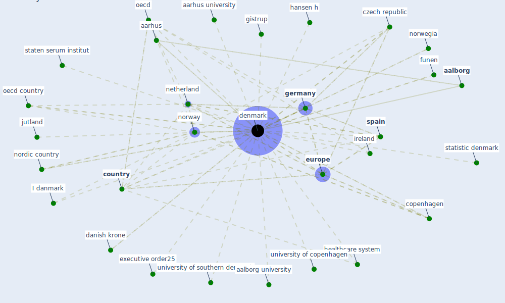

# Keyword: denmark

## Keywords

 * I danmark, [aalborg](keyword_aalborg), aalborg university, aalborg øst, aarhus, aarhus university, [bacs](keyword_bacs), belgium, capital, copenhagen, copenhagen denmark, copenhagen ø, coronamæssigt, [coronavirus](keyword_coronavirus), coronavirus fast spread, coronavirus fast spread and negative impact, [country](keyword_country), [covid 19 pandemic](keyword_covid_19_pandemic), covid 19 school closure, [covid-19](keyword_covid-19), czech republic, danish krone, danish patient safety authority, [danmark](keyword_danmark), [denmark](keyword_denmark), [economy](keyword_economy), energiakademiet, ess, ess country, estonia, eu member state, [europe](keyword_europe), eurostat, executive order25, flour ishe, [flourish](keyword_flourish), flourish prevalence, frandsen f, frandsen f jensen, funen, [germany](keyword_germany), gistrup, [government](keyword_government), government own building, hansen h, health insurance register, healthcare building in denmark, healthcare expenditure, [healthcare system](keyword_healthcare_system), hjemsendelsen, holch, holch j, immigrant gender gap, ireland, jutland, jutland region, kolllega, [københavn](keyword_københavn), linde n j, lyngby, maia boesen, mia boesen, minimum income, minimum income scheme in denmark, ministry of foreign affair, ministry of foreignaffair, [netherland](keyword_netherland), nordic country, norway, norwegia, nutrien, [oecd](keyword_oecd), oecd country, olsen, [pandemic](keyword_pandemic), public healthcare, public healthcare expenditure, publicly fund healthcare system, [region](keyword_region), roskilde university, saa urealistisk, [sar cov 2](keyword_sar_cov_2), skibsfarten, skibsfarten goer status efter halvaar me corona, smittestop, [spain](keyword_spain), state of green, staten serum institut, statens serum institute, statistic denmark, statistiks forbrugertillidsindikator, statsministeren, [sweden](keyword_sweden), the public health insurance register, unicorn, university of copenhagen, university of southern, university of southern denmark

## Mapping

## Neighbours

### Closest articles

* Mental health economics: A prospective study on psychological flourishing and associations with healthcare costs and sickness benefit transfers in Denmark - [LINK](article_santini_mental_2021)
* What has been the impact of the COVID-19 pandemic on immigrants? An update on recent evidence - [LINK](article_oecd_what_2022)
* Refleksioner fra en pandemi - [LINK](article_realdania_refleksioner_2022)
* 2020 Data Protection Report - [LINK](article_council_of_europe_2020_2020)
* Assessment of Building Automation and Control Systems in Danish Healthcare Facilities in the COVID-19 Era - [LINK](article_pedersen_assessment_2022)
* Impact of COVID-19 on IoT Adoption in Healthcare, Smart Homes, Smart Buildings, Smart Cities, Transportation and Industrial IoT - [LINK](article_umair_impact_2021)
* Sustainable work throughout the life course: National policies and strategies, Publications Office of the European Union - [LINK](article_eurofund_sustainable_2016)
* COVID-19 Experience Transforming the Protective Environment of Office Buildings and Spaces - [LINK](article_phapant_covid-19_2021)
* Continuous IEQ monitoring system: Context and development - [LINK](article_parkinson_continuous_2019)
* The role of green roofs in post COVID-19 confinement: An analysis of willingness to pay - [LINK](article_manso_role_2021)

### Closest BPs

