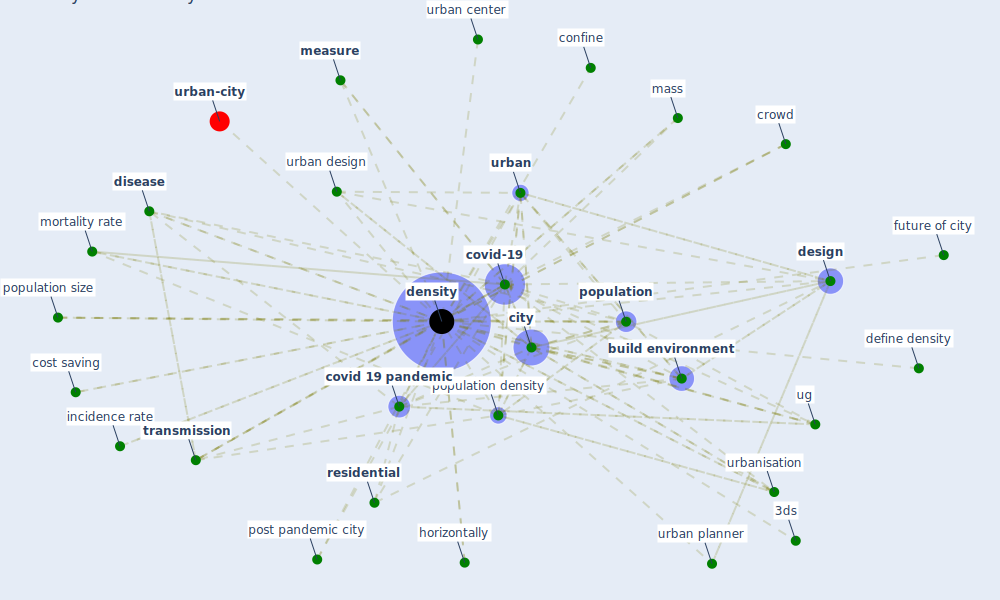

# Keyword: density

* [obesity-county](cluster_9)

## Keywords

 * 3ds, Cluster_9, anatomy of density, build density, [build environment](keyword_build_environment), [city](keyword_city), comfort, comfort condition, confine, connectivity, cost saving, [covid 19 pandemic](keyword_covid_19_pandemic), [covid-19](keyword_covid-19), [crowd](keyword_crowd), define density, densely populate, densely populate settlement, densities, [density](keyword_density), [design](keyword_design), [disease](keyword_disease), fatality rate, future of city, horizontally, incidence rate, many way to measure density, mass, [measure](keyword_measure), [mortality](keyword_mortality), mortality rate, over all densification, parcellation, parcellation of land, [population](keyword_population), population density, population size, post pandemic city, [residential](keyword_residential), significant, socio demographic factor, [spread](keyword_spread), sustainable city and society, [transmission](keyword_transmission), [ug](keyword_ug), [urban](keyword_urban), [urban center](keyword_urban_center), urban design, urban planner, urbanisation

## Mapping

## Neighbours

### Closest articles

* Treating two pandemics for the price of one: Chronic and infectious disease impacts of the built and natural environment - [LINK](article_frank_treating_2021)
* Urban design attributes and resilience: COVID-19 evidence from New York City - [LINK](article_yang_urban_2021)
* The Socio-Spatial Determinants of COVID-19 Diffusion: The Impact of Globalisation, Settlement Characteristics and Population - [LINK](article_sigler_socio-spatial_2020)
* COVID-19 Pandemic: Rethinking Strategies for Resilient Urban Design, Perceptions, and Planning - [LINK](article_afrin_covid-19_2021)
* Understanding the role of urban design in disease spreading - [LINK](article_brizuela_understanding_2019)
* The COVID-19 pandemic: Impacts on cities and major lessons for urban planning, design, and management - [LINK](article_sharifi_covid-19_2020)
* How the Coronavirus Will Reshape Architecture - [LINK](article_chayka_how_2020)
* How is COVID-19 Experience Transforming Sustainability Requirements of Residential Buildings? A Review - [LINK](article_tokazhanov_how_2020)
* Learning from pandemics: Applying resilience thinking to identify priorities for planning urban settlements - [LINK](article_syal_learning_2021)
* COVID-19: Lessons for an Urban(izing) World - [LINK](article_acuto_covid-19_2020)

### Closest BPs

