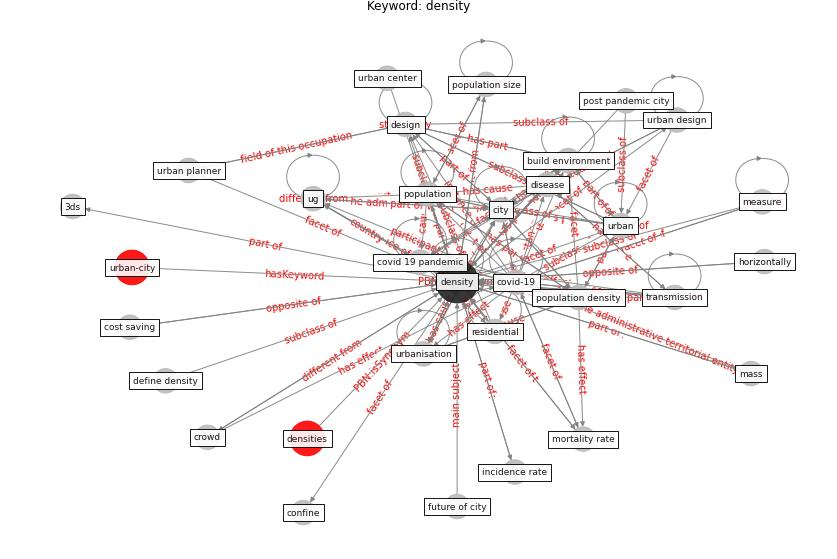

# Keyword: __density__
## Clusters

* Cluster 3: [city-spatial](cluster_3)

## Concepts

 

## Top 10 articles for __density__
* Treating two pandemics for the price of one: Chronic and
infectious disease impacts of the built and natural
environment ([frank_treating_2021](article_frank_treating_2021))
* The Socio-Spatial Determinants of COVID-19
Diffusion: The Impact of Globalisation,
Settlement Characteristics and Population ([sigler_socio-spatial_2020](article_sigler_socio-spatial_2020))
* RUDDS_bioRxiv_update ([RUDDS_bioRxiv_update](article_RUDDS_bioRxiv_update))
* The COVID-19 pandemic: Impacts on cities and major
lessons for urban planning, design, and management ([sharifi_covid-19_2020](article_sharifi_covid-19_2020))
* Green in times of COVID-19: urban green space relevance
during the COVID-19 pandemic in Buenos Aires City ([marconi_green_2022](article_marconi_green_2022))
* Association of built environment attributes with the
spread of COVID-19 at its initial stage in China ([li_association_2021](article_li_association_2021))
* Understanding the role of urban design in disease
spreading ([brizuela_understanding_2019](article_brizuela_understanding_2019))
* afrin_covid-19_2021 ([afrin_covid-19_2021](article_afrin_covid-19_2021))
* chayka_how_2020 ([chayka_how_2020](article_chayka_how_2020))
* COVID-19: Lessons for an Urban(izing) World ([acuto_covid-19_2020](article_acuto_covid-19_2020))
