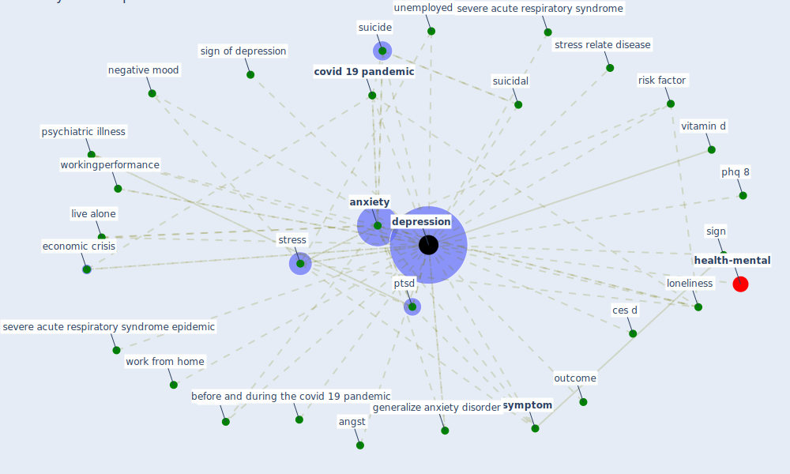

# Keyword: depression

## Keywords

 * angst, [anxiety](keyword_anxiety), anxiety symp tom, before and during the covid 19 pandemic, ces d, [concentration](keyword_concentration), concentration depression, covid 19 outbreak, [covid 19 pandemic](keyword_covid_19_pandemic), depress, [depression](keyword_depression), depressions, depressive symptom and associated factor, early wave of globalisation, [economic crisis](keyword_economic_crisis), emotion, emotional, feeling of loneliness, generalize anxiety disorder, greenness, live alone, [loneliness](keyword_loneliness), mood, negative mood, outcome, phq 8, problematikker, psychiatric illness, psychiatric symptom, ptsd, risk factor, severe acute respiratory syndrome, severe acute respiratory syndrome epidemic, [sign](keyword_sign), sign of depression, [stress](keyword_stress), stress relate disease, suicidal, suicide, [symptom](keyword_symptom), unemployed, vitamin d, work from home, workingperformance, workingperformance from home

## Mapping

## Neighbours

### Closest articles

* Psychological Effects of Home Confinement and Social Distancing Derived from COVID-19 in the General Population—A Systematic Review - [LINK](article_rodriguez-fernandez_psychological_2021)
* Occupant health in buildings: Impact of the COVID-19 pandemic on the opinions of building professionals and implications on research - [LINK](article_awada_occupant_2022)
* Refleksioner fra en pandemi - [LINK](article_realdania_refleksioner_2022)
* Home garden use during COVID-19: Associations with physical and mental wellbeing in older adults - [LINK](article_corley_home_2021)
* COVID-19 Lockdown: Housing Built Environment’s Effects on Mental Health - [LINK](article_amerio_covid-19_2020)
* Propositions for a Resilient, Post-COVID-19 Future for the AEC Industry - [LINK](article_nassereddine_propositions_2021)
* Association between indoor-outdoor green features and psychological health during the COVID-19 lockdown in Italy: A cross-sectional nationwide study - [LINK](article_spano_association_2021)
* Designing for COVID-2x: Reflecting on Future-Proofing Human Habitation for the Inevitable Next Pandemic - [LINK](article_spennemann_designing_2022)
* The changes in the effects of social media use of Cypriots due to COVID-19 pandemic - [LINK](article_kaya_changes_2020)
* Green spaces, especially forest, linked to lower SARS-CoV-2 infection rates: A one-year nationwide study - [LINK](article_jiang_green_2021)

### Closest BPs

