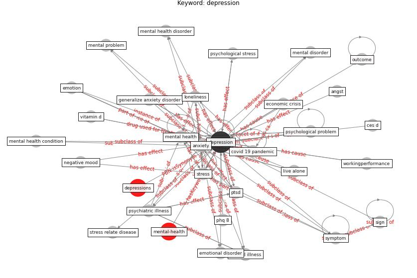

# Keyword: __depression__
## Clusters

* Cluster 11: [anxiety-social](cluster_11)

## Concepts

 

## Top 10 articles for __depression__
* Psychological Effects of Home Confinement and
Social Distancing Derived from COVID-19 in the
General Population—A Systematic Review ([rodriguez-fernandez_psychological_2021](article_rodriguez-fernandez_psychological_2021))
* Occupant health in buildings: Impact of the COVID-19
pandemic on the opinions of building professionals and
implications on research ([awada_occupant_2022](article_awada_occupant_2022))
* Management of the COVID-19 pandemic: challenges,
practices, and organizational support ([hossny_management_2022](article_hossny_management_2022))
* Prophylactic Architecture: Formulating the Concept
of Pandemic-Resilient Homes ([elrayies_prophylactic_2022](article_elrayies_prophylactic_2022))
* realdania_refleksioner_2022_EN ([realdania_refleksioner_2022_EN](article_realdania_refleksioner_2022_EN))
* How loneliness is talked about in social media during
COVID-19 pandemic: Text mining of 4,492 Twitter
feeds ([koh_how_2022](article_koh_how_2022))
* The changes in the effects of social media use of
Cypriots due to COVID-19 pandemic ([kaya_changes_2020](article_kaya_changes_2020))
* Home garden use during COVID-19: Associations with
physical and mental wellbeing in older adults ([corley_home_2021](article_corley_home_2021))
* Association between indoor-outdoor green features and
psychological health during the COVID-19 lockdown in
Italy: A cross-sectional nationwide study ([spano_association_2021](article_spano_association_2021))
* Mental health economics: A prospective study on
psychological flourishing and associations with healthcare
costs and sickness benefit transfers in Denmark ([santini_mental_2021](article_santini_mental_2021))
