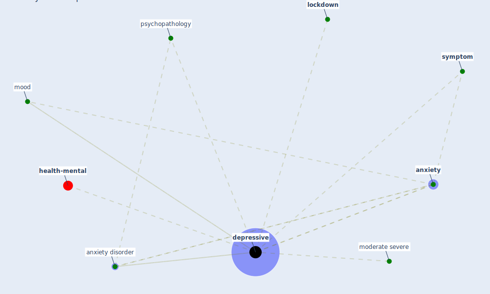

# Keyword: depressive

* [health-mental](cluster_10)

## Keywords

 * Cluster_10, [anxiety](keyword_anxiety), anxiety disorder, [depressive](keyword_depressive), [lockdown](keyword_lockdown), moderate severe, mood, [psychopathology](keyword_psychopathology), [symptom](keyword_symptom)

## Mapping

## Neighbours

### Closest articles

* COVID-19 Lockdown: Housing Built Environment’s Effects on Mental Health - [LINK](article_amerio_covid-19_2020)
* The psychological impact of COVID-19 on the mental health in the general population - [LINK](article_serafini_psychological_2020)
* Mental Health and the Covid-19 Pandemic - [LINK](article_pfefferbaum_mental_2020)
* Psychological Effects of Home Confinement and Social Distancing Derived from COVID-19 in the General Population—A Systematic Review - [LINK](article_rodriguez-fernandez_psychological_2021)
* Home garden use during COVID-19: Associations with physical and mental wellbeing in older adults - [LINK](article_corley_home_2021)
* Refleksioner fra en pandemi - [LINK](article_realdania_refleksioner_2022)
* COVID-19 media fatigue: predictors of decreasing interest and avoidance of COVID-19–related news - [LINK](article_buneviciene_covid-19_2021)
* COVID-19 and Green Housing: A Review of Relevant Literature - [LINK](article_kaklauskas_covid-19_2021)

### Closest BPs

