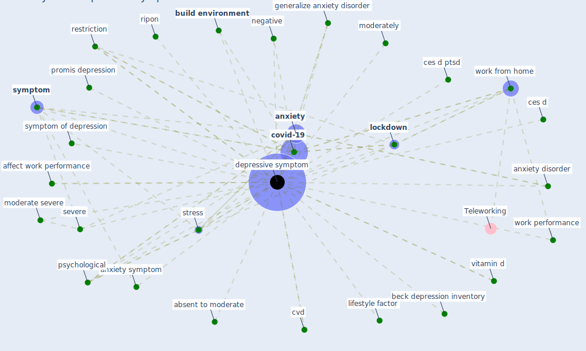

# Keyword: depressive symptom

## Keywords

 * absent to moderate, affect work performance, [anxiety](keyword_anxiety), anxiety disorder, anxiety symptom, beck depression inventory, [build environment](keyword_build_environment), ces d, ces d ptsd, [covid-19](keyword_covid-19), cvd, [depressive symptom](keyword_depressive_symptom), depressive symptoms, generalize anxiety disorder, lifestyle factor, [lockdown](keyword_lockdown), moderate severe, moderately, negative, promis depression, [psychological](keyword_psychological), [restriction](keyword_restriction), ripon, severe, [stress](keyword_stress), [symptom](keyword_symptom), symptom of depression, vitamin d, work from home, work performance

## Mapping

## Neighbours

### Closest articles

* COVID-19 Lockdown: Housing Built Environment’s Effects on Mental Health - [LINK](article_amerio_covid-19_2020)
* Psychological Effects of Home Confinement and Social Distancing Derived from COVID-19 in the General Population—A Systematic Review - [LINK](article_rodriguez-fernandez_psychological_2021)
* Home garden use during COVID-19: Associations with physical and mental wellbeing in older adults - [LINK](article_corley_home_2021)
* The psychological impact of COVID-19 on the mental health in the general population - [LINK](article_serafini_psychological_2020)
* The changes in the effects of social media use of Cypriots due to COVID-19 pandemic - [LINK](article_kaya_changes_2020)
* COVID-19 and Green Housing: A Review of Relevant Literature - [LINK](article_kaklauskas_covid-19_2021)
* How COVID-19 Redefines the Concept of Sustainability - [LINK](article_hakovirta_how_2020)

### Closest BPs

