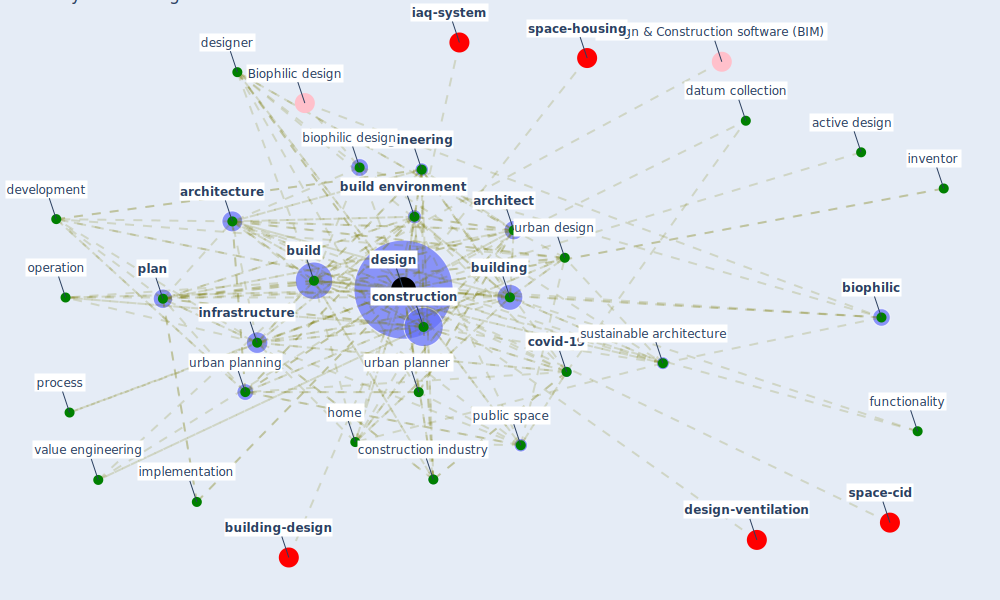

# Keyword: design

* [space-housing](cluster_2)

* [building-design](cluster_3)

* [design-ventilation](cluster_4)

* [space-cid](cluster_5)

* [iaq-system](cluster_12)

## Keywords

 * active design, aesthetic, [architect](keyword_architect), [architectural](keyword_architectural), [architecture](keyword_architecture), [biophilic](keyword_biophilic), [biophilic design](keyword_biophilic_design), [build](keyword_build), [build environment](keyword_build_environment), build industry, build management, build professional, [building](keyword_building), building br group, circular, [city](keyword_city), city planning, client, con struction, conception, [construction](keyword_construction), [construction industry](keyword_construction_industry), [covid-19](keyword_covid-19), datum collection, decision make, [design](keyword_design), design process, design professional, designer, development, disassembly, [engineering](keyword_engineering), ergonomic, evaluation, [facility management](keyword_facility_management), financing, fitness center, functionality, healthaspractitioner, healthc, high risk facility, [home](keyword_home), hypothesis formulation, implementation, information visualization, [infrastructure](keyword_infrastructure), integrate design process, interactive design system, interior designer, inventor, iteration, landscape, lifecycle, look and feel, look feel, [management](keyword_management), [material](keyword_material), [method](keyword_method), methodology, microbiology, minimum space standard, modell, [nature](keyword_nature), off the plan, operation, pedestrian orient link, perform, [plan](keyword_plan), planning process, process, [professional](keyword_professional), programming, [project](keyword_project), [public space](keyword_public_space), regeneration, regenerative development, renovation, [research](keyword_research), research synthesis, residence, rigid, risk of bias, [route](keyword_route), site level factors, small housing unit, software, [solution](keyword_solution), sound dampen, soundness, soundscape, [sustainable architecture](keyword_sustainable_architecture), [system analysis](keyword_system_analysis), typologically, urban biodiversity, urban design, urban planner, [urban planning](keyword_urban_planning), [urbanism](keyword_urbanism), [value engineering](keyword_value_engineering), yanko

## Mapping

## Neighbours

### Closest articles

* Biophilic design in architecture and its contributions to health, well-being, and sustainability: A critical review - [LINK](article_zhong_biophilic_2022)
* Respiratory pandemics, urban planning and design: A multidisciplinary rapid review of the literature - [LINK](article_harris_respiratory_2022)
* A Global Survey of Infection Control and Mitigation Measures for Combating the Transmission of COVID-19 Pandemic in Buildings Under Facilities Management Services - [LINK](article_sarvari_global_2022)
* Navigating Climate Change: Rethinking the Role of Buildings - [LINK](article_cole_navigating_2020)
* Health, Wellbeing \& Productivity in Offices - [LINK](article_world_green_building_council_health_2014)
* COVID-19 Pandemic: Rethinking Strategies for Resilient Urban Design, Perceptions, and Planning - [LINK](article_afrin_covid-19_2021)
* Propositions for a Resilient, Post-COVID-19 Future for the AEC Industry - [LINK](article_nassereddine_propositions_2021)
* Occupant health in buildings: Impact of the COVID-19 pandemic on the opinions of building professionals and implications on research - [LINK](article_awada_occupant_2022)
* Antivirus-built environment: Lessons learned from Covid-19 pandemic - [LINK](article_megahed_antivirus-built_2020)
* Overcoming the Impact of COVID-19 Using Integrated Project Delivery Model - [LINK](article_g_overcoming_2020)

### Closest BPs

