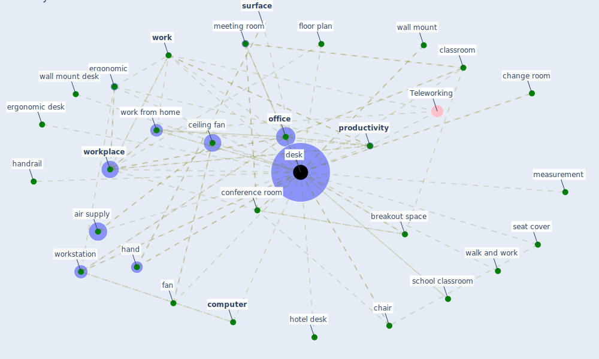

# Keyword: desk

## Keywords

 * air supply, breakout space, ceiling fan, [chair](keyword_chair), change room, classroom, [computer](keyword_computer), conference room, [desk](keyword_desk), ergonomic, ergonomic desk, fan, floor plan, hand, handrail, hotel desk, measurement, meeting room, [office](keyword_office), [productivity](keyword_productivity), school classroom, seat cover, [surface](keyword_surface), walk and work, wall mount, wall mount desk, [work](keyword_work), work from home, [workplace](keyword_workplace), [workstation](keyword_workstation)

## Mapping

## Neighbours

### Closest articles

* The ventilation of buildings and other mitigating measures for COVID-19: a focus on wintertime - [LINK](article_burridge_ventilation_2021)
* The COVID-19 Impact on Flexible Office Space - [LINK](article_clifton_covid-19_2020)
* Prophylactic Architecture: Formulating the Concept of Pandemic-Resilient Homes - [LINK](article_elrayies_prophylactic_2022)
* Designing a Multi-Agent Occupant Simulation System to Support Facility Planning and Analysis for COVID-19 - [LINK](article_lee_designing_2021)
* Methods for air cleaning and protection of building occupants from airborne pathogens - [LINK](article_bolashikov_methods_2009)
* Occupant health in buildings: Impact of the COVID-19 pandemic on the opinions of building professionals and implications on research - [LINK](article_awada_occupant_2022)
* Toilets dominate environmental detection of SARS-CoV-2 virus in a hospital - [LINK](article_ding_toilets_2020)
* Designing for COVID-2x: Reflecting on Future-Proofing Human Habitation for the Inevitable Next Pandemic - [LINK](article_spennemann_designing_2022)
* Association between indoor-outdoor green features and psychological health during the COVID-19 lockdown in Italy: A cross-sectional nationwide study - [LINK](article_spano_association_2021)
* COVID-19 Experience Transforming the Protective Environment of Office Buildings and Spaces - [LINK](article_phapant_covid-19_2021)

### Closest BPs

