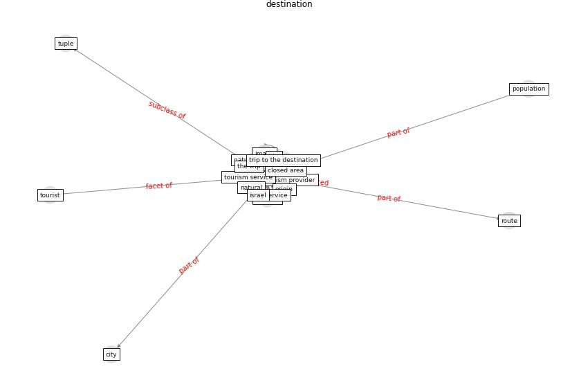

# Keyword: __destination__
## Clusters

* Cluster 7: [tourism-tourist](cluster_7)

## Concepts

 

## Top 10 articles for __destination__
* Should I Stay or Should I Go? Tourists’
COVID-19 Risk Perception and Vacation Behavior
Shift ([bratic_should_2021](article_bratic_should_2021))
* Seeing the invisible hand: Underlying effects of
COVID-19 on tourists’ behavioral patterns ([li_seeing_2020](article_li_seeing_2020))
* COVID19-Routes: A Safe Pedestrian Navigation
Service ([cantarero_covid19-routes_2021](article_cantarero_covid19-routes_2021))
* realdania_refleksioner_2022_EN ([realdania_refleksioner_2022_EN](article_realdania_refleksioner_2022_EN))
* Exploring the Non-Medical impacts of Covid-19 using
Natural Language Processing ([agade_exploring_2020](article_agade_exploring_2020))
* Coronavirus questions that will not go away: interrogating
urban and socio-spatial implications of COVID-19
measures ([salama_coronavirus_2020](article_salama_coronavirus_2020))
* RUDDS_bioRxiv_update ([RUDDS_bioRxiv_update](article_RUDDS_bioRxiv_update))
* Understanding the role of urban design in disease
spreading ([brizuela_understanding_2019](article_brizuela_understanding_2019))
* Treating two pandemics for the price of one: Chronic and
infectious disease impacts of the built and natural
environment ([frank_treating_2021](article_frank_treating_2021))
* How COVID-19 Could Accelerate the Adoption of
New Retail Technologies and Enhance the
(E-)Servicescape ([willems_how_2021](article_willems_how_2021))
