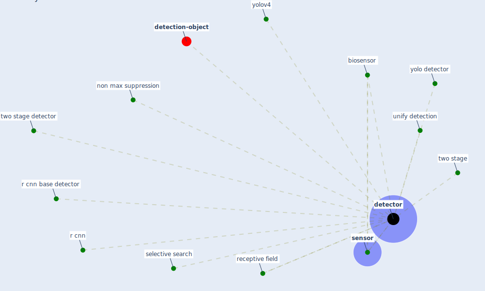

# Keyword: detector

* [detection-object](cluster_8)

## Keywords

 * Cluster_8, [biosensor](keyword_biosensor), [detector](keyword_detector), detectors, non max suppression, r cnn, r cnn base detector, receptive field, selective search, [sensor](keyword_sensor), two stage, two stage detector, unify detection, yolo detector, yolov4

## Mapping

## Neighbours

### Closest articles

* DeepSOCIAL: Social Distancing Monitoring and Infection Risk Assessment in COVID-19 Pandemic - [LINK](article_rezaei_deepsocial_2020)
* Recently employed engineering techniques to reduce the spread of COVID-19 (corona virus disease 2019): a review study - [LINK](article_saman_recently_2021)
*  - [LINK](article_dalessandro_covid-19_2020)
* Towards the sustainable development of smart cities through mass video surveillance: A response to the COVID-19 pandemic - [LINK](article_shorfuzzaman_towards_2021)
* How is COVID-19 Experience Transforming Sustainability Requirements of Residential Buildings? A Review - [LINK](article_tokazhanov_how_2020)
* Impact of COVID-19 on IoT Adoption in Healthcare, Smart Homes, Smart Buildings, Smart Cities, Transportation and Industrial IoT - [LINK](article_umair_impact_2021)

### Closest BPs

