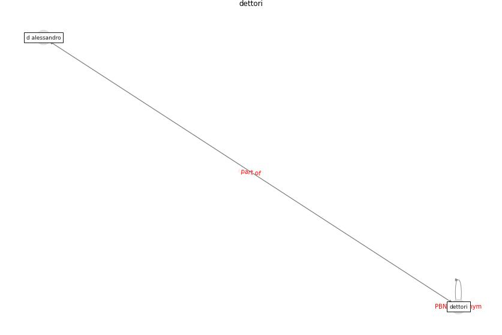

# Keyword: __dettori__
## Clusters

* Cluster 8: [health-housing](cluster_8)

## Concepts

 

## Top 10 articles for __dettori__
* Readiness Assessment of Green Building
Certification Systems for Residential Buildings
during Pandemics ([tleuken_readiness_2021](article_tleuken_readiness_2021))
* Exploring the Non-Medical impacts of Covid-19 using
Natural Language Processing ([agade_exploring_2020](article_agade_exploring_2020))
* A Mixed Approach on Resilience of Spanish
Dwellings and Households during COVID-19 Lockdown ([cuerdo-vilches_mixed_2020](article_cuerdo-vilches_mixed_2020))
* How is COVID-19 Experience Transforming
Sustainability Requirements of Residential
Buildings? A Review ([tokazhanov_how_2020](article_tokazhanov_how_2020))
