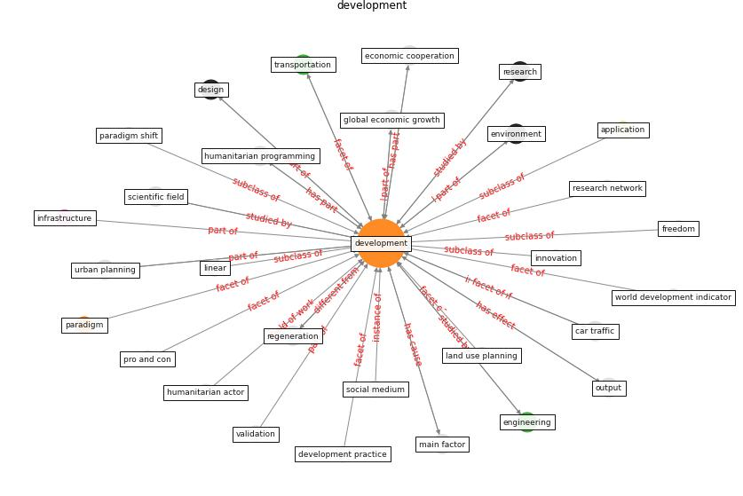

# Keyword: development

* [health-pca](cluster_Cluster_0)

* [sustainability-pillar](cluster_Cluster_9)

## Keywords

 * Cluster_0, Cluster_9, action, [application](keyword_application), [architecture](keyword_architecture), catalyze, [china](keyword_china), climate action, continuous monitoring, covid 19 vaccine, debt relief, decade, [delivery](keyword_delivery), deployment, [design](keyword_design), design practice, [development](keyword_development), development bank, development practice, developments, drug discovery, economic activity, economic aid, economic cooperation, economic development, economic growth, [economy](keyword_economy), [engineering](keyword_engineering), evaluation, financial service, focus series, framework, framework development, freedom, general health indicator, global economic growth, habitat iii, [health](keyword_health), humanitarian, humanitarian actor, humanitarian programming, hypothesis, impact evaluation, information technology, [infrastructure](keyword_infrastructure), infrastructure investment, initial validation, [innovation](keyword_innovation), job creation, land use planning, learn, life cycle, linear, main factor, max neef, [oecd](keyword_oecd), output, paradigm, paradigm shift, place management, [plan](keyword_plan), poverty alleviation, pro and con, professional development program, regeneration, regenerative, [research](keyword_research), research direction, research network, residential construction, [resilience](keyword_resilience), [robotic](keyword_robotic), rural area, science, scientific advice, scientific field, [social](keyword_social), [social medium](keyword_social_medium), stability, stability of the environment, [sustainability](keyword_sustainability), [sustainable](keyword_sustainable), [sustainable development](keyword_sustainable_development), sustainable development capability, sustainable growth, [technology](keyword_technology), trade, [training](keyword_training), transportation, trial, united nations conference on environment and development, unsustainable, urban community, urban design, [urban planning](keyword_urban_planning), urban recovery, [vaccine](keyword_vaccine), vaccine in market, validation, wireless technology

## Concepts

 

## Neighbours

### Closest articles

* Navigating Climate Change: Rethinking the Role of Buildings - [LINK](article_cole_navigating_2020)
* COVID-19: IMPACT OF THE PANDEMIC ON THE SUSTAINABLE DEVELOPMENT GOALS - [LINK](article_samout_covid-19_2020)
* World Bank Development Report - [LINK](article_world_bank_world_2022)
* Urban planning after COVID-19 - [LINK](article_rtpi_urban_2021)
* How COVID-19 Could Accelerate the Adoption of New Retail Technologies and Enhance the (E-)Servicescape - [LINK](article_willems_how_2021)
* Revisiting the built environment: 10 potential development changes and paradigm shifts due to COVID-19 - [LINK](article_cheshmehzangi_revisiting_2021)
* Guidelines for resilience systems analysis - [LINK](article_oecd_guidelines_2014)
* Impact of COVID-19 on IoT Adoption in Healthcare, Smart Homes, Smart Buildings, Smart Cities, Transportation and Industrial IoT - [LINK](article_umair_impact_2021)
* COVID-19 and Green Housing: A Review of Relevant Literature - [LINK](article_kaklauskas_covid-19_2021)
* Strengthening resilience: a priority shared by Health 2020 and - [LINK](article_who_strengthening_2017)

### Closest BPs

