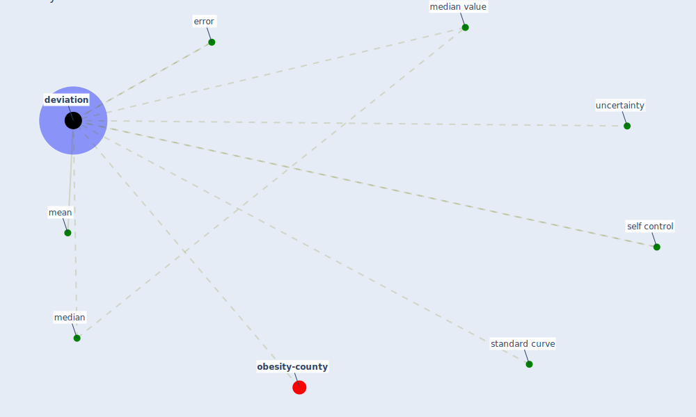

# Keyword: deviation

* [obesity-county](cluster_9)

## Keywords

 * Cluster_9, [deviation](keyword_deviation), deviations, error, mean, median, median value, self control, standard curve, uncertainty

## Mapping

## Neighbours

### Closest articles

* The efficacy of social distance and ventilation effectiveness in preventing COVID-19 transmission - [LINK](article_sun_efficacy_2020)
* SARS-CoV-2 Titers in Wastewater Are Higher than Expected from Clinically Confirmed Cases - [LINK](article_wu_sars-cov-2_2020)
* The changes in the effects of social media use of Cypriots due to COVID-19 pandemic - [LINK](article_kaya_changes_2020)
* Compliance with COVID-19 Mitigation Measures in the United States - [LINK](article_van_rooij_compliance_2020)

### Closest BPs

