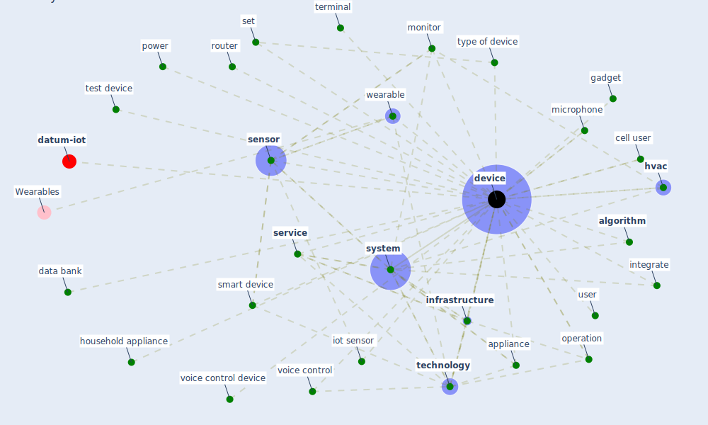

# Keyword: device

* [iot-blockchain](cluster_7)

## Keywords

 * Cluster_7, aircleane, [algorithm](keyword_algorithm), appliance, browser, cell, cell user, co location testing, consumer air cleaning, consumer air cleaning device, contact datum, data bank, [device](keyword_device), devices, electricity, every device, fet biosensor, gadget, hardware, household appliance, [hvac](keyword_hvac), [infrastructure](keyword_infrastructure), integrate, integrate system, internet connection, [internet of thing](keyword_internet_of_thing), [iot](keyword_iot), iot sensor, microphone, [monitor](keyword_monitor), [network](keyword_network), operation, outdoor air, [power](keyword_power), router, [sensor](keyword_sensor), [service](keyword_service), set, smart device, [system](keyword_system), [technology](keyword_technology), terminal, test device, type of device, [user](keyword_user), voice control, voice control device, [wearable](keyword_wearable), wearable device

## Mapping

## Neighbours

### Closest articles

* Future (post-COVID) digital, smart and sustainable cities in the wake of 6G: Digital twins, immersive realities and new urban economies - [LINK](article_allam_future_2021)
* A Comprehensive Review of the COVID-19 Pandemic and the Role of IoT, Drones, AI, Blockchain, and 5G in Managing its Impact - [LINK](article_chamola_comprehensive_2020)
* Impact of COVID-19 on IoT Adoption in Healthcare, Smart Homes, Smart Buildings, Smart Cities, Transportation and Industrial IoT - [LINK](article_umair_impact_2021)
* A Mixed Approach on Resilience of Spanish Dwellings and Households during COVID-19 Lockdown - [LINK](article_cuerdo-vilches_mixed_2020)
* A critical review of heating, ventilation, and air conditioning (HVAC) systems within the context of a global SARS-CoV-2 epidemic - [LINK](article_elsaid_critical_2021)
* An Intelligent IEQ Monitoring and Feedback System: Development and Applications - [LINK](article_geng_intelligent_2021)
* An Automated System to Limit COVID-19 Using Facial Mask Detection in Smart City Network - [LINK](article_rahman_automated_2020)
* Wastewater-Based Epidemiology to monitor COVID-19 outbreak: Present and future diagnostic methods to be in your radar - [LINK](article_barcelo_wastewater-based_2020)
* Mobile Technology Solution for COVID-19: Surveillance and Prevention - [LINK](article_raza_mobile_2021)
* Scalable IoT Architecture for Monitoring IEQ Conditions in Public and Private Buildings - [LINK](article_calvo_scalable_2022)

### Closest BPs

