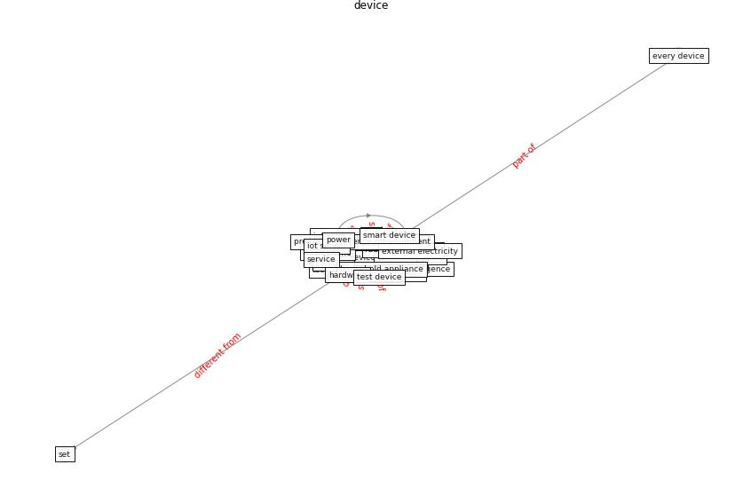

# Keyword: __device__
## Clusters

* Cluster 13: [blockchain-technology](cluster_13.md)

## Concepts

 

## Articles
* A Comprehensive Review of the COVID-19 Pandemic
and the Role of IoT, Drones, AI, Blockchain, and
5G in Managing its Impact ([chamola_comprehensive_2020](article_chamola_comprehensive_2020.md))
* A Mixed Approach on Resilience of Spanish
Dwellings and Households during COVID-19 Lockdown ([cuerdo-vilches_mixed_2020](article_cuerdo-vilches_mixed_2020.md))
* An Intelligent IEQ Monitoring and Feedback
System: Development and Applications ([geng_intelligent_2021](article_geng_intelligent_2021.md))
* Impact of COVID-19 on IoT Adoption in Healthcare,
Smart Homes, Smart Buildings, Smart Cities,
Transportation and Industrial IoT ([umair_impact_2021](article_umair_impact_2021.md))
* Future (post-COVID) digital, smart and sustainable
cities in the wake of 6G: Digital twins, immersive
realities and new urban economies ([allam_future_2021](article_allam_future_2021.md))
* Scalable IoT Architecture for Monitoring IEQ
Conditions in Public and Private Buildings ([calvo_scalable_2022](article_calvo_scalable_2022.md))
* Wastewater-Based Epidemiology to monitor COVID-19
outbreak: Present and future diagnostic methods to be in
your radar ([barcelo_wastewater-based_2020](article_barcelo_wastewater-based_2020.md))
* Future (post-COVID) digital, smart and sustainable
cities in the wake of 6G: Digital twins, immersive
realities and new urban economies ([allam_future_2021](article_allam_future_2021.md))
* Mobile Technology Solution for COVID-19:
Surveillance and Prevention ([raza_mobile_2021](article_raza_mobile_2021.md))
* COVID19-Routes: A Safe Pedestrian Navigation
Service ([cantarero_covid19-routes_2021](article_cantarero_covid19-routes_2021.md))
