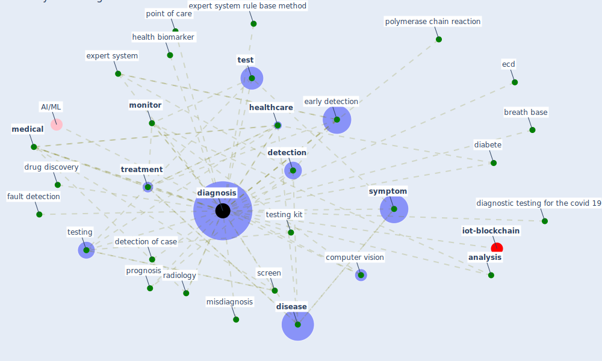

# Keyword: diagnosis

* [iot-blockchain](cluster_7)

## Keywords

 * Cluster_7, [analysis](keyword_analysis), biosense, breath base, [clinical](keyword_clinical), [computer vision](keyword_computer_vision), consultation, [detection](keyword_detection), detection of case, [diabete](keyword_diabete), diagn, [diagnosis](keyword_diagnosis), diagnostic testing, diagnostic testing for the covid 19, [disease](keyword_disease), doctor, drug discovery, early detection, ecd, evaluation, [expert system](keyword_expert_system), expert system diagnostic, expert system rule base method, fault detection, health biomarker, [healthcare](keyword_healthcare), immune pathogenesis, [infectious disease](keyword_infectious_disease), label free, laboratory, laboratory environment, low cost, [machine learning](keyword_machine_learning), [medical](keyword_medical), misdiagnosis, molecular immune pathogenesis, [monitor](keyword_monitor), nankai university and inference technology, [pcr](keyword_pcr), point of care, point of care antigen, polymerase chain reaction, [prevention](keyword_prevention), prognosis, radiology, rapid diagnosis, screen, [symptom](keyword_symptom), [telemedicine](keyword_telemedicine), [test](keyword_test), testing, testing kit, [treatment](keyword_treatment), workflow

## Mapping

## Neighbours

### Closest articles

* How the 5G Enabled the COVID-19 Pandemic Prevention and Control: Materiality, Affordance, and (De-)Spatialization - [LINK](article_li_how_2022)
* Design COVID-19 Ontology: A Healthcare and Safety Perspective - [LINK](article_aloulou_design_2022)
* Risk Diagnosis and Mitigation System of COVID-19 Using Expert System and Web Scraping - [LINK](article_mufid_risk_2020)
* A Comprehensive Review of the COVID-19 Pandemic and the Role of IoT, Drones, AI, Blockchain, and 5G in Managing its Impact - [LINK](article_chamola_comprehensive_2020)
* Leveraging Digital Transformation Technologies to Tackle COVID-19: Proposing a Privacy-First Holistic Framework - [LINK](article_arpaci_leveraging_2021)
* Pandemic Analytics: How Countries are Leveraging Big Data Analytics and Artificial Intelligence to Fight COVID-19? - [LINK](article_mehta_pandemic_2021)
* Contributions of Smart City Solutions and Technologies to Resilience against the COVID-19 Pandemic: A Literature Review - [LINK](article_sharifi_contributions_2021)
* Construction of a Linked Data Set of COVID-19 Knowledge Graphs: Development and Applications - [LINK](article_wang_construction_2022)
* Mobile Technology Solution for COVID-19: Surveillance and Prevention - [LINK](article_raza_mobile_2021)
* Impact of COVID-19 on IoT Adoption in Healthcare, Smart Homes, Smart Buildings, Smart Cities, Transportation and Industrial IoT - [LINK](article_umair_impact_2021)

### Closest BPs

