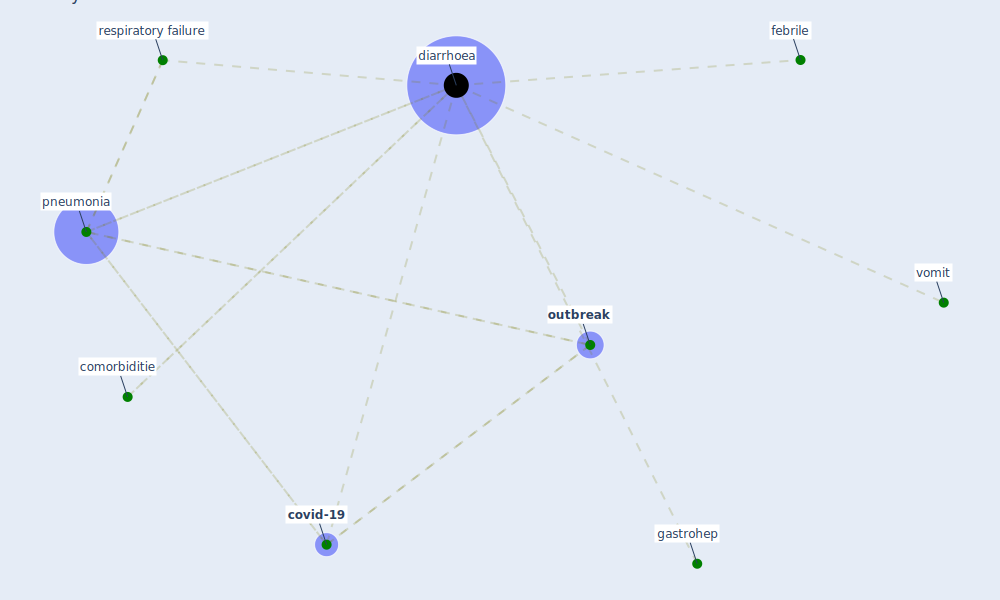

# Keyword: diarrhoea

## Keywords

 * comorbiditie, [covid-19](keyword_covid-19), [diarrhoea](keyword_diarrhoea), febrile, gastrohep, [outbreak](keyword_outbreak), pneumonia, respiratory failure, vomit

## Mapping

## Neighbours

### Closest articles

* SARS-CoV-2 in wastewater: potential health risk, but also data source - [LINK](article_lodder_sars-cov-2_2020)
* Toilets dominate environmental detection of SARS-CoV-2 virus in a hospital - [LINK](article_ding_toilets_2020)
*  - [LINK](article_mehtab_alam_role_2021)
* An Overview of Biomedical Ontologies for Pandemics and Infectious Diseases Representation - [LINK](article_bayoudhi_overview_2021)

### Closest BPs

