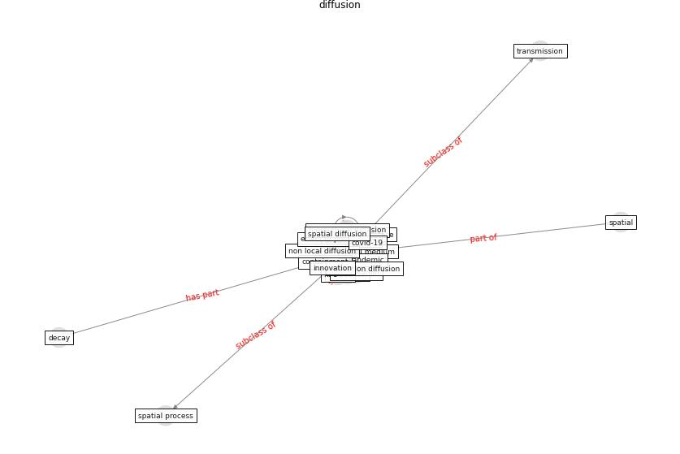

# Keyword: __diffusion__
## Clusters

* Cluster 3: [city-spatial](cluster_3)

## Concepts

 

## Top 10 articles for __diffusion__
* The Socio-Spatial Determinants of COVID-19
Diffusion: The Impact of Globalisation,
Settlement Characteristics and Population ([sigler_socio-spatial_2020](article_sigler_socio-spatial_2020))
* Designing a Multi-Agent Occupant Simulation
System to Support Facility Planning and Analysis
for COVID-19 ([lee_designing_2021](article_lee_designing_2021))
* p15-lee-vor ([p15-lee-vor](article_p15-lee-vor))
* The COVID-19 pandemic: Impacts on cities and major
lessons for urban planning, design, and management ([sharifi_covid-19_2020](article_sharifi_covid-19_2020))
* Exploring the Non-Medical impacts of Covid-19 using
Natural Language Processing ([agade_exploring_2020](article_agade_exploring_2020))
* A critical analysis of the impacts of COVID-19 on the
global economy and ecosystems and opportunities for
circular economy strategies ([ibn-mohammed_critical_2021](article_ibn-mohammed_critical_2021))
* Infodemic and the spread of fake news in the
COVID-19-era ([orso_infodemic_2020](article_orso_infodemic_2020))
* How COVID-19 Could Accelerate the Adoption of
New Retail Technologies and Enhance the
(E-)Servicescape ([willems_how_2021](article_willems_how_2021))
* Health, Economic and Social Development Challenges
of the COVID-19 Pandemic: Strategies for Multiple
and Interconnected Issues ([panneer_health_2022](article_panneer_health_2022))
