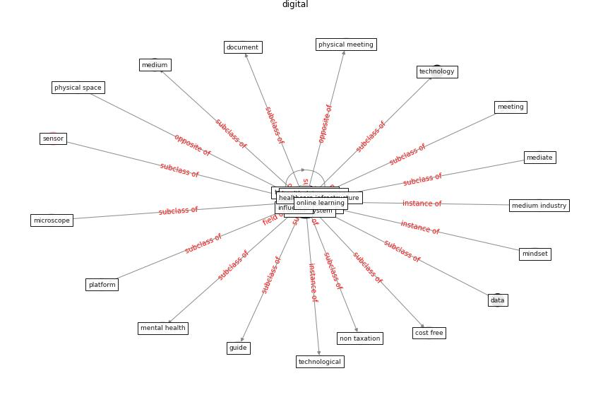

# Keyword: digital

* [blockchain-ontology](cluster_Cluster_11)

## Keywords

 * Cluster_11, analog, banking, [china](keyword_china), communication, credit market, customer experience, [datum](keyword_datum), [digital](keyword_digital), digital solution, digital tooling, digitalization, digitally, document, file electronically, finance, financial, financial inclusion, financial service, guide, hard copy, health datum space, healthcare infrastructure, ict, influencer, kulturoplevelse, live stream, mediate, microscope, mindset, non taxation, online learning, [pandemic](keyword_pandemic), payment, [pcr](keyword_pcr), pcr modeling, [physical](keyword_physical), [physical space](keyword_physical_space), platform, retail, retailing, rt pcr, [sensor](keyword_sensor), technological, [technology](keyword_technology), telecommunication, virtual, virtual system

## Concepts

 

## Neighbours

### Closest articles

* Smart cities and the pandemic: digital technologies on the urban management of Brazilian cities - [LINK](article_fariniuk_smart_2020)
* How COVID-19 Could Accelerate the Adoption of New Retail Technologies and Enhance the (E-)Servicescape - [LINK](article_willems_how_2021)
* World Bank Development Report - [LINK](article_world_bank_world_2022)
* Scalable IoT Architecture for Monitoring IEQ Conditions in Public and Private Buildings - [LINK](article_calvo_scalable_2022)
* Computational analysis of SARS-CoV-2/COVID-19 surveillance by wastewater-based epidemiology locally and globally: Feasibility, economy, opportunities and challenges - [LINK](article_hart_computational_2020)
* Coronavirus: Can artificial intelligence be smart enough to detect fake news? - [LINK](article_tong_coronavirus_2020)
* Proximity and post-COVID-19 urban development: Reflections from Milan, Italy - [LINK](article_tricarico_proximity_2021)
* Case Study on Finnish TVETA Resilient Model of Training During COVID-19 - [LINK](article_unesco_case_2021)
* Designing a Multi-Agent Occupant Simulation System to Support Facility Planning and Analysis for COVID-19 - [LINK](article_lee_designing_2021)
* Amplifying the role of knowledge translation platforms in the COVID-19 pandemic response - [LINK](article_el-jardali_amplifying_2020)

### Closest BPs

