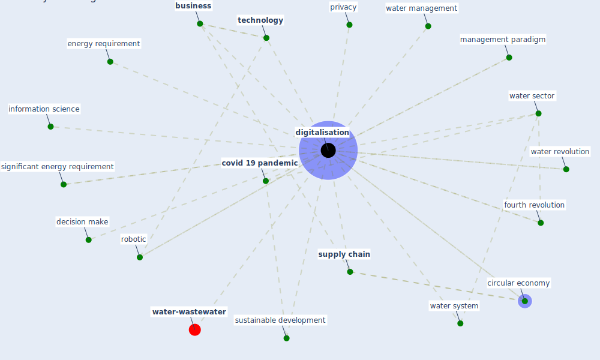

# Keyword: digitalisation

* [water-wastewater](cluster_7)

## Keywords

 * Cluster_7, [business](keyword_business), [circular economy](keyword_circular_economy), [covid 19 pandemic](keyword_covid_19_pandemic), decision make, [digitalisation](keyword_digitalisation), energy requirement, fourth revolution, information science, management paradigm, [privacy](keyword_privacy), [robotic](keyword_robotic), significant energy requirement, [supply chain](keyword_supply_chain), [sustainable development](keyword_sustainable_development), [technology](keyword_technology), water management, water revolution, water sector, water system

## Mapping

## Neighbours

### Closest articles

* When the fourth water and digital revolution encountered COVID-19 - [LINK](article_poch_when_2020)
* A critical analysis of the impacts of COVID-19 on the global economy and ecosystems and opportunities for circular economy strategies - [LINK](article_ibn-mohammed_critical_2021)
* Case Study on Finnish TVETA Resilient Model of Training During COVID-19 - [LINK](article_unesco_case_2021)
* Impact of COVID-19 on IoT Adoption in Healthcare, Smart Homes, Smart Buildings, Smart Cities, Transportation and Industrial IoT - [LINK](article_umair_impact_2021)
* Learning from the COVID-19 pandemic in governing smart cities - [LINK](article_bolivar_learning_2022)
* Urban planning after COVID-19 - [LINK](article_rtpi_urban_2021)

### Closest BPs

